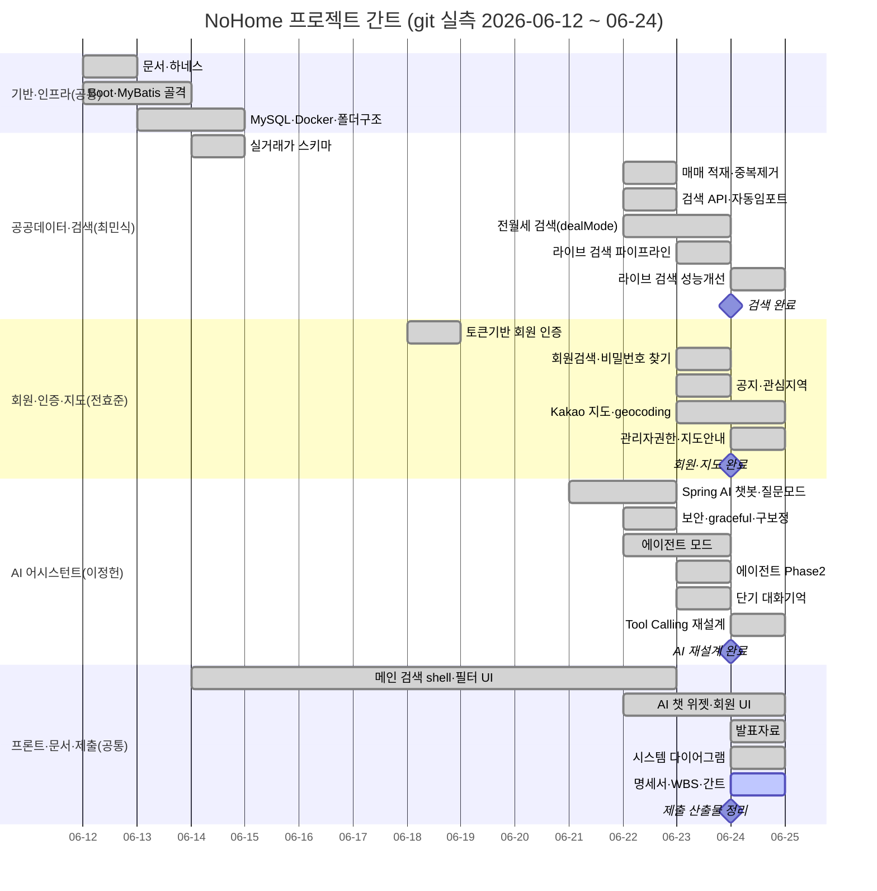

# NoHome WBS & 간트 차트

> 프로젝트: **NoHome** — 공공데이터 기반 아파트 실거래가 검색 서비스
> 문서 버전: 1.0 / 작성일: 2026-06-24
> **일정 기준: git 커밋 실측(2026-06-12 ~ 06-24)**. 문서(Sprint) 타임라인은 참조로 병기.
> 담당: 이정헌(AI) · 최민식(공공데이터·검색) · 전효준(회원·지도)

---

## 1. 담당·일정 요약 (git 실측)

| 담당 | 영역 | 활동 기간(git) | 커밋수(3 repo 합) | 주요 PR |
| --- | --- | --- | --- | --- |
| **이정헌** | AI 어시스턴트·보안·공공데이터 보정 | 06-12 ~ 06-24 | ~53 | #2,5,6,7,16,18,20,28,29 |
| **최민식** | 공공데이터·실거래가 검색·인프라 | 06-14, 06-22 ~ 06-24 | ~18 | #13,23,27,30 |
| **전효준** | 회원·인증·지도·관심지역 | 06-18, 06-23 ~ 06-24 | ~11 | #1,22,26,33 |

> 계정 매핑: 이정헌=colosair/colosair99 · 최민식=cmsik1/cmsik2 · 전효준=hyojun/jhj4862123/1548604/jjeonyo(머지)

---

## 2. WBS (작업 분해 구조)

계층: **L1 프로젝트 → L2 작업 패키지 → L3 태스크**. 상태: ✅완료 / 🔄진행중 / ⬜대기

| ID | 작업명 | 담당 | 시작 | 종료 | 상태 | 참조(Sprint/PR) |
| --- | --- | --- | --- | --- | --- | --- |
| **1** | **프로젝트 기반·인프라** | 공/민 | 06-12 | 06-14 | ✅ | M0~M1, S0~1 |
| 1.1 | 문서·하네스(PRD·spec·plan) | 공 | 06-12 | 06-12 | ✅ | S0 |
| 1.2 | Spring Boot·MyBatis 골격, /api/health | 공 | 06-12 | 06-13 | ✅ | S1 |
| 1.3 | MySQL·Docker compose, .env | 민 | 06-13 | 06-14 | ✅ | S1 |
| 1.4 | 폴더구조(Backend/Frontend/Artifact) | 민 | 06-14 | 06-14 | ✅ | S10, 초기설정 |
| **2** | **공공데이터·실거래가 검색** | 민 | 06-14 | 06-24 | ✅ | M2, S2~5 |
| 2.1 | 실거래가 스키마(regions/houses/house_deals) | 민 | 06-14 | 06-14 | ✅ | S2 |
| 2.2 | 매매 API 적재·XML 파싱·api_row_hash 중복제거 | 민 | 06-22 | 06-22 | ✅ | S3, #13 |
| 2.3 | 통합 검색 API(/houses/search)·자동임포트 | 민 | 06-22 | 06-22 | ✅ | S4~5 |
| 2.4 | 전월세 검색(dealMode·스키마 확장) | 민 | 06-22 | 06-23 | ✅ | #23 |
| 2.5 | 라이브 검색 파이프라인(응답우선+비동기 적재) | 민 | 06-23 | 06-23 | ✅ | #27 |
| 2.6 | 라이브 검색 성능 개선(batch, numOfRows 1000) | 민 | 06-24 | 06-24 | ✅ | #30 |
| **3** | **회원·인증·지도** | 효 | 06-18 | 06-24 | ✅ | M3·M4, S6~9 |
| 3.1 | 토큰기반 회원 인증(가입/로그인/CRUD) | 효 | 06-18 | 06-18 | ✅ | S6, #1 |
| 3.2 | 회원 검색 + 비밀번호 찾기 | 효 | 06-23 | 06-23 | ✅ | #22 |
| 3.3 | 공지사항 + 관심지역 | 효 | 06-23 | 06-23 | ✅ | #26 |
| 3.4 | Kakao 지도 연동·geocoding·마커 | 효 | 06-23 | 06-24 | ✅ | S9, #33 |
| 3.5 | 회원검색 관리자권한(403)·지도 안내 | 효 | 06-24 | 06-24 | ✅ | #33 |
| **4** | **AI 어시스턴트** | 이 | 06-21 | 06-24 | ✅ | 추가기능 트랙 |
| 4.1 | Spring AI 챗봇·질문모드·사용량 제한 | 이 | 06-21 | 06-22 | ✅ | #2 |
| 4.2 | GMS 키 graceful·JWT fail-closed·서울구 보정 | 이 | 06-22 | 06-22 | ✅ | #5,6,7 |
| 4.3 | 에이전트 모드(구조화 명령 화면조작) | 이 | 06-22 | 06-23 | ✅ | #16 |
| 4.4 | 에이전트 Phase2(필터·액션 확장) | 이 | 06-23 | 06-23 | ✅ | #18 |
| 4.5 | 공공데이터 resultCode "000" 보정 | 이 | 06-23 | 06-23 | ✅ | #20 |
| 4.6 | 단기 대화기억(InMemory window 10) | 이 | 06-23 | 06-23 | ✅ | #28 |
| 4.7 | Tool Calling 혼합형 재설계(/assistant 단일화) | 이 | 06-24 | 06-24 | ✅ | #29 |
| **5** | **프론트엔드 화면·UX** | 공 | 06-14 | 06-24 | ✅ | M4, S7~12 |
| 5.1 | 메인 검색/목록/상세 shell, 지도 placeholder | 민 | 06-14 | 06-22 | ✅ | S7 |
| 5.2 | 검색 필터 UI(전월세·가격 슬라이더·정렬) | 민 | 06-22 | 06-23 | ✅ | S11 |
| 5.3 | 회원 패널·관심지역 UI | 효 | 06-23 | 06-24 | ✅ | #8,10,16(FE) |
| 5.4 | AI 챗 위젯·에이전트 런타임·리사이즈 | 이 | 06-22 | 06-24 | ✅ | FE #13,17 |
| 5.5 | 법정동 select·결과카드·mojibake 보정 | 민 | 06-23 | 06-24 | ✅ | S11~12 |
| **6** | **문서·발표·제출** | 이/공 | 06-12 | 06-24 | 🔄 | M7 준비 |
| 6.1 | Sprint·AI 설계/구현/트러블슈팅 문서 | 이 | 06-12 | 06-24 | ✅ | docs/* |
| 6.2 | 발표자료(구성안·대본·시연) | 공 | 06-24 | 06-24 | ✅ | presentation/ |
| 6.3 | 시스템 다이어그램(클래스·ERD·유스케이스) | 공 | 06-24 | 06-24 | ✅ | diagrams/ |
| 6.4 | 요구사항 명세서·WBS·간트 | 공 | 06-24 | 06-24 | 🔄 | deliverables/ |

---

## 3. 간트 차트 (Mermaid)

---

## 4. 마일스톤 체크포인트 (문서 매핑 참조)

| 마일스톤 | 목표 | 포함 Sprint(문서) | git 실측 시기 | 상태 |
| --- | --- | --- | --- | --- |
| M0 | 계획·하네스 | S0 | 06-12 | ✅ |
| M1 | 골격·DB 연결 | S1 | 06-12~14 | ✅ |
| M2 | 실거래가 데이터·검색 | S2~5 | 06-14·06-22 | ✅ |
| M3 | 회원 CRUD·인증 | S6,8 | 06-18·06-23 | ✅ |
| M4 | 주택정보·필수 화면/지도 | S7~12 | 06-14~06-24 | ✅(핵심) |
| (추가) | AI 어시스턴트 트랙 | - | 06-21~06-24 | ✅ |
| M7 | 검증·제출 산출물 | - | 06-24~ | 🔄 |

> **계획↔실적 주석**: 문서(working-memory)의 Sprint 진행 표기는 2026-05-29~06-14이나, 실제 커밋 이력은 06-12~06-24다. 본 WBS·간트는 **검증 가능한 git 커밋일을 1차 기준**으로 하고, Sprint 번호는 작업 범위 식별용으로만 참조한다. 일부 태스크의 세부 시작일은 작성자별 커밋 분포로 근사했다.

---

## 5. 관련 산출물
- 요구사항 명세서: [requirements-spec.md](requirements-spec.md)
- 시스템 다이어그램: [클래스](../diagrams/class-diagrams.md) · [ERD](../diagrams/erd.md) · [유스케이스](../diagrams/usecase-diagrams.md)
- 발표자료: [presentation/](../presentation/README.md)
