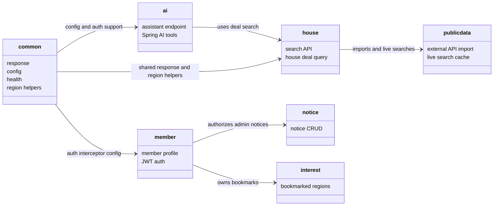
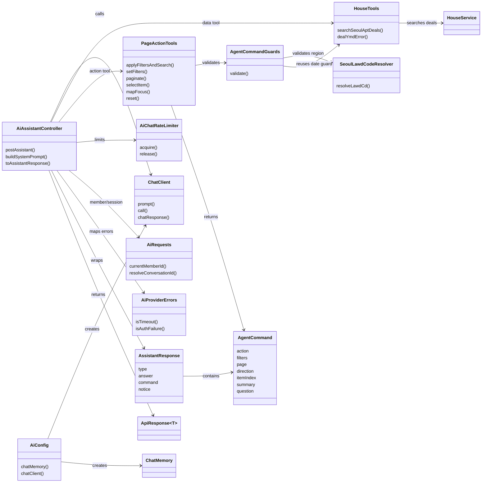
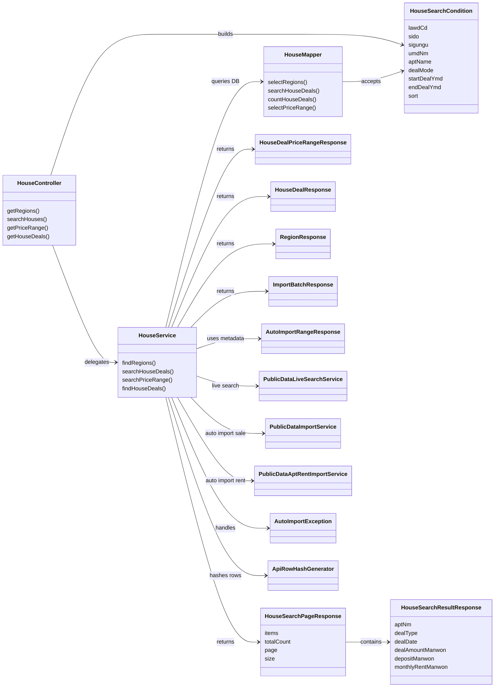
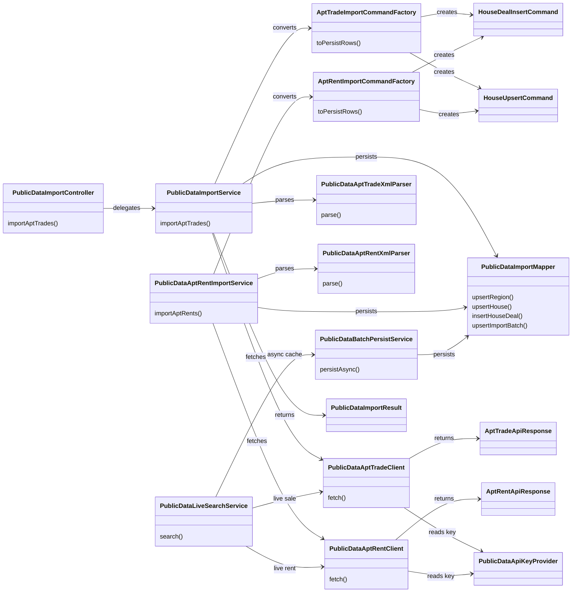
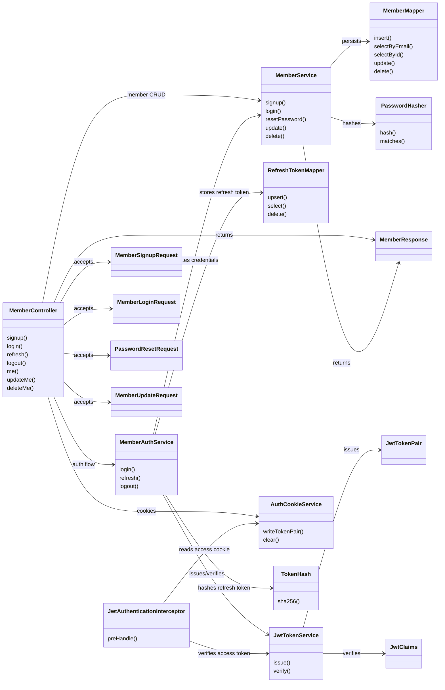
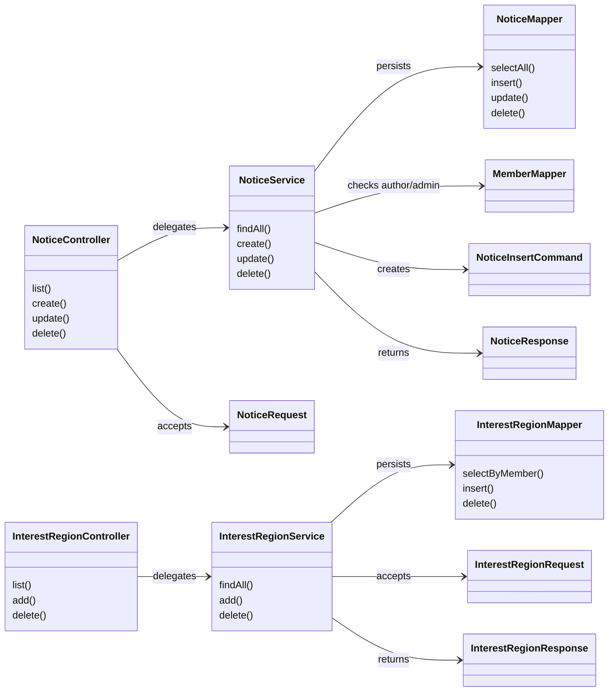
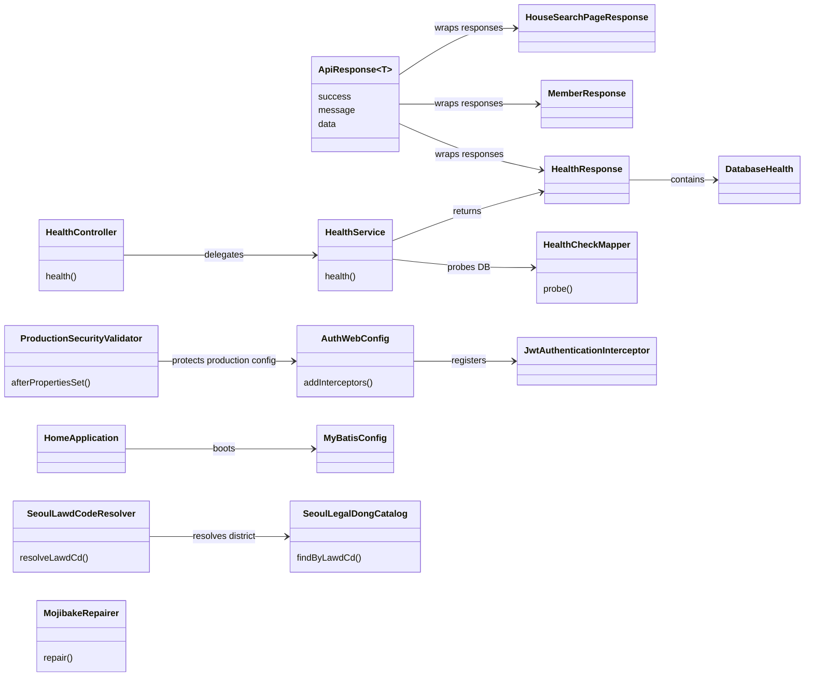

# NoHome Class Diagrams

현재 프로젝트 기준의 백엔드 클래스 다이어그램을 Mermaid Markdown으로 정리한다.
한 그림에 모든 클래스를 담으면 렌더링 크기가 작아지므로, 도메인별 확대도 중심으로 분리했다.

## 기준 소스

- Backend classes: `no-home-backend/src/main/java/com/ssafy/home`
- AI docs: `no-home-backend/docs/ai-chatbot`

## 1. 백엔드 패키지 개요



Mermaid source


```mermaid
classDiagram
direction LR

class ai {
  assistant endpoint
  Spring AI tools
}
class house {
  search API
  house deal query
}
class publicdata {
  external API import
  live search cache
}
class member {
  member profile
  JWT auth
}
class notice {
  notice CRUD
}
class interest {
  bookmarked regions
}
class common {
  response
  config
  health
  region helpers
}

ai --> house : uses deal search
house --> publicdata : imports and live searches
member --> notice : authorizes admin notices
member --> interest : owns bookmarks
common --> ai : config and auth support
common --> house : shared response and region helpers
common --> member : auth interceptor config
```

읽는 법:

- 이 그림은 내부 클래스가 아니라 패키지 사이의 책임과 큰 의존 방향만 보여준다.
- 아래의 도메인별 클래스 다이어그램을 읽기 전 전체 지도를 빠르게 잡는 용도다.

생략 기준:

- DTO, Mapper, 예외 클래스는 이 개요 그림에서 생략했다.

## 2. AI 챗봇 클래스 다이어그램



Mermaid source


```mermaid
classDiagram
direction LR

class AiAssistantController {
  postAssistant()
  buildSystemPrompt()
  toAssistantResponse()
}
class ChatClient {
  prompt()
  call()
  chatResponse()
}
class AiConfig {
  chatMemory()
  chatClient()
}
class HouseTools {
  searchSeoulAptDeals()
  dealYmdError()
}
class PageActionTools {
  applyFiltersAndSearch()
  setFilters()
  paginate()
  selectItem()
  mapFocus()
  reset()
}
class AgentCommand {
  action
  filters
  page
  direction
  itemIndex
  summary
  question
}
class AgentCommandGuards {
  validate()
}
class AssistantResponse {
  type
  answer
  command
  notice
}
class AiChatRateLimiter {
  acquire()
  release()
}
class AiRequests {
  currentMemberId()
  resolveConversationId()
}
class AiProviderErrors {
  isTimeout()
  isAuthFailure()
}
class SeoulLawdCodeResolver {
  resolveLawdCd()
}
class ApiResponse~T~

AiAssistantController --> ChatClient : calls
AiAssistantController --> HouseTools : data tool
AiAssistantController --> PageActionTools : action tool
AiAssistantController --> AiChatRateLimiter : limits
AiAssistantController --> AiRequests : member/session
AiAssistantController --> AiProviderErrors : maps errors
AiAssistantController --> AssistantResponse : wraps
AiAssistantController --> ApiResponse~T~ : returns
AiConfig --> ChatClient : creates
AiConfig --> ChatMemory : creates
HouseTools --> HouseService : searches deals
PageActionTools --> AgentCommandGuards : validates
PageActionTools --> AgentCommand : returns
AgentCommandGuards --> SeoulLawdCodeResolver : validates region
AgentCommandGuards --> HouseTools : reuses date guard
AssistantResponse --> AgentCommand : contains
```

읽는 법:

- `AiAssistantController`는 `POST /api/ai/assistant` 단일 엔드포인트다.
- 질문 의도는 `HouseTools` 데이터 tool을 거쳐 텍스트 답변이 되고, 화면 조작 의도는 `PageActionTools`가 `AgentCommand`를 반환한다.
- `AssistantResponse.type`은 `answer` 또는 `command`로 프론트 분기 기준이 된다.

생략 기준:

- `AiKeyEnvironmentPostProcessor`, `HouseToolException` 등 운영/예외 보조 클래스는 그림을 작게 유지하기 위해 제외했다.

## 3. 주택 검색 클래스 다이어그램



Mermaid source


```mermaid
classDiagram
direction LR

class HouseController {
  getRegions()
  searchHouses()
  getPriceRange()
  getHouseDeals()
}
class HouseService {
  findRegions()
  searchHouseDeals()
  searchPriceRange()
  findHouseDeals()
}
class HouseMapper {
  selectRegions()
  searchHouseDeals()
  countHouseDeals()
  selectPriceRange()
}
class HouseSearchCondition {
  lawdCd
  sido
  sigungu
  umdNm
  aptName
  dealMode
  startDealYmd
  endDealYmd
  sort
}
class HouseSearchPageResponse {
  items
  totalCount
  page
  size
}
class HouseSearchResultResponse {
  aptNm
  dealType
  dealDate
  dealAmountManwon
  depositManwon
  monthlyRentManwon
}
class HouseDealPriceRangeResponse
class HouseDealResponse
class RegionResponse
class ImportBatchResponse
class AutoImportRangeResponse
class PublicDataLiveSearchService
class PublicDataImportService
class PublicDataAptRentImportService
class AutoImportException
class ApiRowHashGenerator

HouseController --> HouseService : delegates
HouseController --> HouseSearchCondition : builds
HouseService --> HouseMapper : queries DB
HouseService --> PublicDataLiveSearchService : live search
HouseService --> PublicDataImportService : auto import sale
HouseService --> PublicDataAptRentImportService : auto import rent
HouseService --> AutoImportException : handles
HouseService --> ApiRowHashGenerator : hashes rows
HouseService --> HouseSearchPageResponse : returns
HouseSearchPageResponse --> HouseSearchResultResponse : contains
HouseService --> HouseDealPriceRangeResponse : returns
HouseService --> HouseDealResponse : returns
HouseService --> RegionResponse : returns
HouseService --> ImportBatchResponse : returns
HouseService --> AutoImportRangeResponse : uses metadata
HouseMapper --> HouseSearchCondition : accepts
```

읽는 법:

- `HouseController`는 검색 API를 받고, `HouseService`가 DB 조회와 자동/라이브 공공데이터 조회를 조율한다.
- `HouseMapper`는 MyBatis로 `regions`, `houses`, `house_deals`, `public_data_import_batches`를 조회한다.

생략 기준:

- 내부 private record와 단순 변환 로직은 제외했다.

## 4. 공공데이터 적재 클래스 다이어그램



Mermaid source


```mermaid
classDiagram
direction LR

class PublicDataImportController {
  importAptTrades()
}
class PublicDataImportService {
  importAptTrades()
}
class PublicDataAptRentImportService {
  importAptRents()
}
class PublicDataLiveSearchService {
  search()
}
class PublicDataBatchPersistService {
  persistAsync()
}
class PublicDataAptTradeClient {
  fetch()
}
class PublicDataAptRentClient {
  fetch()
}
class PublicDataAptTradeXmlParser {
  parse()
}
class PublicDataAptRentXmlParser {
  parse()
}
class AptTradeImportCommandFactory {
  toPersistRows()
}
class AptRentImportCommandFactory {
  toPersistRows()
}
class PublicDataImportMapper {
  upsertRegion()
  upsertHouse()
  insertHouseDeal()
  upsertImportBatch()
}
class PublicDataApiKeyProvider
class AptTradeApiResponse
class AptRentApiResponse
class HouseUpsertCommand
class HouseDealInsertCommand
class PublicDataImportResult

PublicDataImportController --> PublicDataImportService : delegates
PublicDataImportService --> PublicDataAptTradeClient : fetches
PublicDataImportService --> PublicDataAptTradeXmlParser : parses
PublicDataImportService --> AptTradeImportCommandFactory : converts
PublicDataImportService --> PublicDataImportMapper : persists
PublicDataImportService --> PublicDataImportResult : returns
PublicDataAptRentImportService --> PublicDataAptRentClient : fetches
PublicDataAptRentImportService --> PublicDataAptRentXmlParser : parses
PublicDataAptRentImportService --> AptRentImportCommandFactory : converts
PublicDataAptRentImportService --> PublicDataImportMapper : persists
PublicDataLiveSearchService --> PublicDataAptTradeClient : live sale
PublicDataLiveSearchService --> PublicDataAptRentClient : live rent
PublicDataLiveSearchService --> PublicDataBatchPersistService : async cache
PublicDataBatchPersistService --> PublicDataImportMapper : persists
PublicDataAptTradeClient --> PublicDataApiKeyProvider : reads key
PublicDataAptRentClient --> PublicDataApiKeyProvider : reads key
AptTradeImportCommandFactory --> HouseUpsertCommand : creates
AptTradeImportCommandFactory --> HouseDealInsertCommand : creates
AptRentImportCommandFactory --> HouseUpsertCommand : creates
AptRentImportCommandFactory --> HouseDealInsertCommand : creates
PublicDataAptTradeClient --> AptTradeApiResponse : returns
PublicDataAptRentClient --> AptRentApiResponse : returns
```

읽는 법:

- 매매와 전월세는 클라이언트/파서/팩토리가 분리되어 있지만, 최종 저장은 `PublicDataImportMapper`로 모인다.
- 라이브 검색은 사용자 응답을 빠르게 돌려주고 `PublicDataBatchPersistService`로 비동기 캐싱한다.

생략 기준:

- API item record, id mapping record, 예외 세부 사유 enum은 제외했다.

## 5. 회원과 인증 클래스 다이어그램



Mermaid source


```mermaid
classDiagram
direction LR

class MemberController {
  signup()
  login()
  refresh()
  logout()
  me()
  updateMe()
  deleteMe()
}
class MemberService {
  signup()
  login()
  resetPassword()
  update()
  delete()
}
class MemberAuthService {
  login()
  refresh()
  logout()
}
class MemberMapper {
  insert()
  selectByEmail()
  selectById()
  update()
  delete()
}
class RefreshTokenMapper {
  upsert()
  select()
  delete()
}
class JwtAuthenticationInterceptor {
  preHandle()
}
class JwtTokenService {
  issue()
  verify()
}
class AuthCookieService {
  writeTokenPair()
  clear()
}
class PasswordHasher {
  hash()
  matches()
}
class TokenHash {
  sha256()
}
class MemberResponse
class MemberSignupRequest
class MemberLoginRequest
class PasswordResetRequest
class MemberUpdateRequest
class JwtTokenPair
class JwtClaims

MemberController --> MemberService : member CRUD
MemberController --> MemberAuthService : auth flow
MemberController --> AuthCookieService : cookies
MemberController --> MemberResponse : returns
MemberService --> MemberMapper : persists
MemberService --> PasswordHasher : hashes
MemberService --> MemberResponse : returns
MemberAuthService --> MemberService : validates credentials
MemberAuthService --> JwtTokenService : issues/verifies
MemberAuthService --> RefreshTokenMapper : stores refresh token
MemberAuthService --> TokenHash : hashes refresh token
JwtAuthenticationInterceptor --> AuthCookieService : reads access cookie
JwtAuthenticationInterceptor --> JwtTokenService : verifies access token
JwtTokenService --> JwtTokenPair : issues
JwtTokenService --> JwtClaims : verifies
MemberController --> MemberSignupRequest : accepts
MemberController --> MemberLoginRequest : accepts
MemberController --> PasswordResetRequest : accepts
MemberController --> MemberUpdateRequest : accepts
```

읽는 법:

- 회원 정보 관리는 `MemberService`, 로그인/토큰 재발급/로그아웃은 `MemberAuthService`가 맡는다.
- 인증된 API는 `JwtAuthenticationInterceptor`가 쿠키의 access token을 검증한 뒤 요청 속성에 회원 id를 실어준다.

생략 기준:

- `MemberException`, `MemberErrorCode`, `AuthenticatedMember` 같은 보조 타입은 제외했다.

## 6. 공지와 관심지역 클래스 다이어그램



Mermaid source


```mermaid
classDiagram
direction LR

class NoticeController {
  list()
  create()
  update()
  delete()
}
class NoticeService {
  findAll()
  create()
  update()
  delete()
}
class NoticeMapper {
  selectAll()
  insert()
  update()
  delete()
}
class NoticeRequest
class NoticeResponse
class NoticeInsertCommand

class InterestRegionController {
  list()
  add()
  delete()
}
class InterestRegionService {
  findAll()
  add()
  delete()
}
class InterestRegionMapper {
  selectByMember()
  insert()
  delete()
}
class InterestRegionRequest
class InterestRegionResponse
class MemberMapper

NoticeController --> NoticeService : delegates
NoticeService --> NoticeMapper : persists
NoticeService --> MemberMapper : checks author/admin
NoticeService --> NoticeInsertCommand : creates
NoticeService --> NoticeResponse : returns
NoticeController --> NoticeRequest : accepts

InterestRegionController --> InterestRegionService : delegates
InterestRegionService --> InterestRegionMapper : persists
InterestRegionService --> InterestRegionRequest : accepts
InterestRegionService --> InterestRegionResponse : returns
```

읽는 법:

- 공지는 작성자/관리자 확인 때문에 회원 도메인과 연결된다.
- 관심지역은 회원과 지역의 다대다 성격을 `interest_regions` 테이블로 푼 기능이다.

생략 기준:

- 예외 클래스와 에러코드 enum은 제외했다.

## 7. 공통 인프라 클래스 다이어그램



Mermaid source


```mermaid
classDiagram
direction LR

class HomeApplication
class ApiResponse~T~ {
  success
  message
  data
}
class AuthWebConfig {
  addInterceptors()
}
class MyBatisConfig
class ProductionSecurityValidator {
  afterPropertiesSet()
}
class HealthController {
  health()
}
class HealthService {
  health()
}
class HealthCheckMapper {
  probe()
}
class HealthResponse
class DatabaseHealth
class SeoulLawdCodeResolver {
  resolveLawdCd()
}
class SeoulLegalDongCatalog {
  findByLawdCd()
}
class MojibakeRepairer {
  repair()
}
class JwtAuthenticationInterceptor

HomeApplication --> MyBatisConfig : boots
AuthWebConfig --> JwtAuthenticationInterceptor : registers
HealthController --> HealthService : delegates
HealthService --> HealthCheckMapper : probes DB
HealthService --> HealthResponse : returns
HealthResponse --> DatabaseHealth : contains
ProductionSecurityValidator --> AuthWebConfig : protects production config
SeoulLawdCodeResolver --> SeoulLegalDongCatalog : resolves district
ApiResponse~T~ --> HealthResponse : wraps responses
ApiResponse~T~ --> MemberResponse : wraps responses
ApiResponse~T~ --> HouseSearchPageResponse : wraps responses
```

읽는 법:

- 공통 인프라는 애플리케이션 부팅, 인증 인터셉터 등록, MyBatis 스캔, 헬스체크, 공통 응답 포맷을 담당한다.

생략 기준:

- 실제 각 도메인에서 `ApiResponse<T>`로 감싸는 모든 응답 타입을 전부 연결하지 않고 대표 타입만 표시했다.
