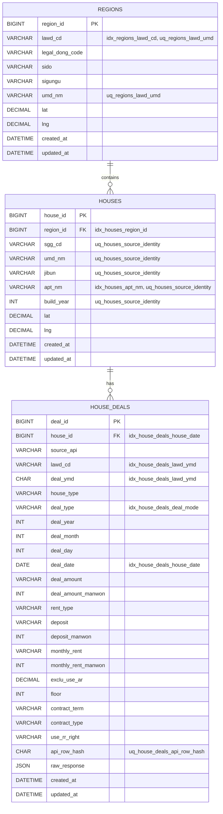
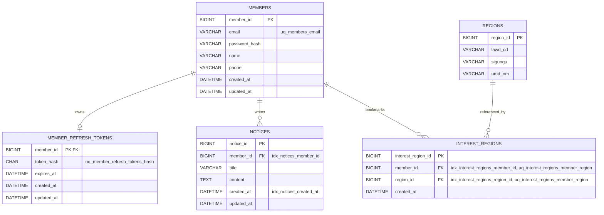
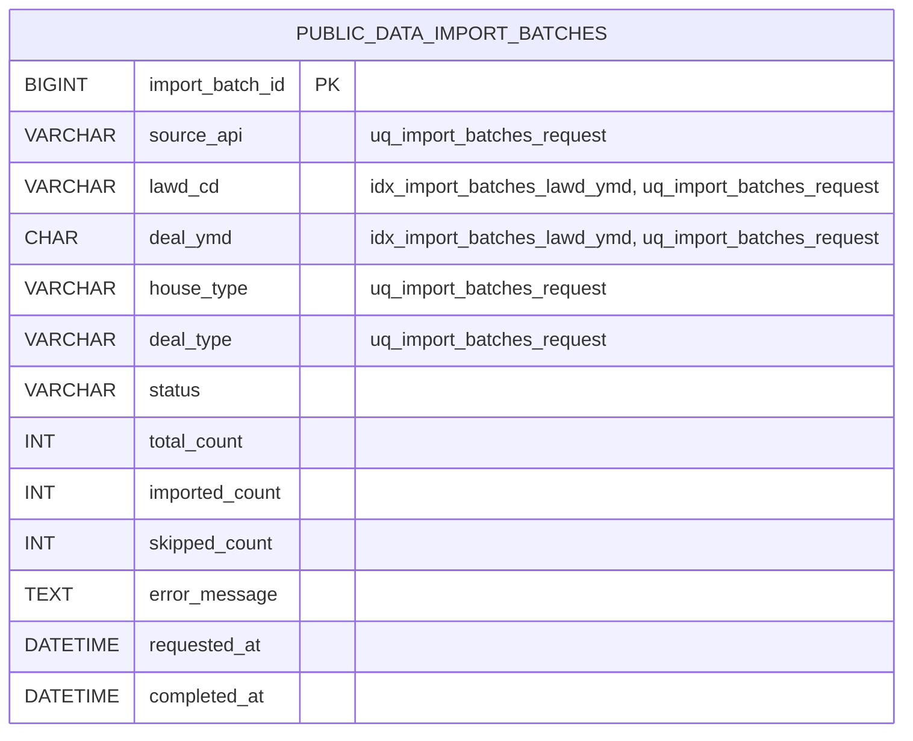

# NoHome ERD

현재 프로젝트 기준의 ERD를 Mermaid Markdown으로 정리한다.
한 그림에 모든 테이블을 담으면 렌더링 크기가 작아지므로, 기능 영역별로 분리했다.

## 기준 소스

- DB: `no-home-backend/src/main/resources/schema.sql`

## 1. 실거래가 ERD

읽는 법:

- `regions -> houses -> house_deals`가 실거래가 검색의 핵심 관계다.
- `house_deals`는 매매와 전월세 컬럼을 함께 가진다.

생략 기준:

- `house_deals`의 공공데이터 원문 보조 컬럼 일부는 확대도를 위해 생략했다.

## 2. 회원 기능 ERD

읽는 법:

- 회원은 refresh token, 공지, 관심지역의 기준 엔티티다.
- `interest_regions`는 회원과 지역의 중복 등록을 `uq_interest_regions_member_region`으로 막는다.

생략 기준:

- 관심지역 설명에 필요한 `REGIONS` 컬럼만 축약 표시했다.

## 3. 공공데이터 적재 추적 ERD

읽는 법:

- 이 테이블은 직접 FK가 없다.
- `source_api`, `lawd_cd`, `deal_ymd`, `house_type`, `deal_type` 조합으로 공공데이터 적재와 캐시 상태를 추적한다.

생략 기준:

- 이 그림은 독립 추적 테이블만 보여주므로 다른 ERD와 관계선을 연결하지 않았다.
