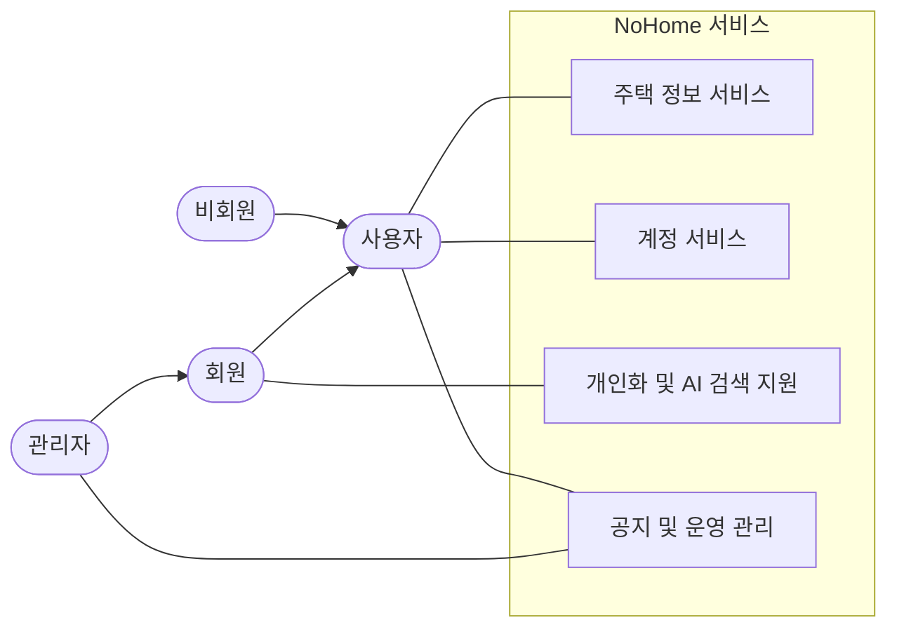

# NoHome Use Case Diagrams

NoHome usecase 다이어그램을 제출 자료에서 나눠 설명할 수 있도록 아티팩트별로 분리했다. 각 다이어그램은 구현 요소가 아니라, 시스템 밖의 액터가 NoHome을 통해 달성하는 사용자 목표를 중심으로 작성한다.

## 분리 기준

- [주택 정보 서비스](./usecases/house-usecase.md): 실거래가 검색, 가격 조건 검색, 상세 정보, 지도 위치 확인
- [계정 서비스](./usecases/account-usecase.md): 회원가입, 로그인, 비밀번호 재설정, 내 계정 관리
- [개인화 및 AI 검색 지원](./usecases/personal-ai-usecase.md): 관심 지역 관리, AI 기반 주택 검색 도움
- [공지 및 운영 관리](./usecases/notice-operation-usecase.md): 공지 확인, 공지 관리, 회원 관리, 공공데이터 동기화
- [외부 시스템 연동](./usecases/external-system-usecase.md): 공공데이터 API, Kakao Map API, AI Chat API와의 관계

## 전체 요약

## 공통 작성 기준

- 비회원과 회원이 공통으로 사용하는 조회 기능은 상위 액터인 `사용자`에 연결한다.
- 회원 전용 목표는 `회원`, 운영 권한이 필요한 목표는 `관리자`에 연결한다.
- CRUD는 세부 동작을 모두 나열하지 않고 `관리하기` 단위로 묶는다.
- 외부 API는 사용자가 아니라 보조 시스템으로 표현한다.
- `Controller`, `Service`, `Mapper`, `DB`, `JWT Filter`, `Scheduler` 같은 내부 구현 요소는 제외한다.
- `include`, `extend`는 제출용 가독성을 위해 꼭 필요한 경우가 아니면 생략한다.
