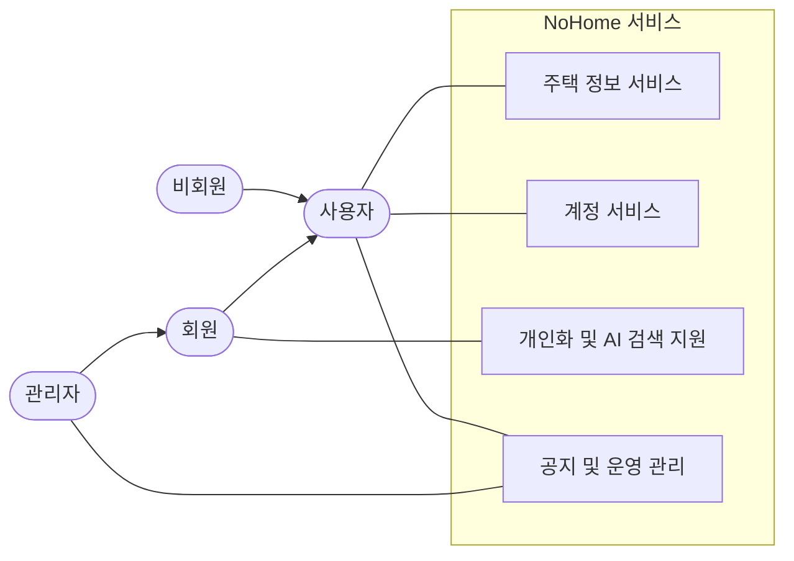
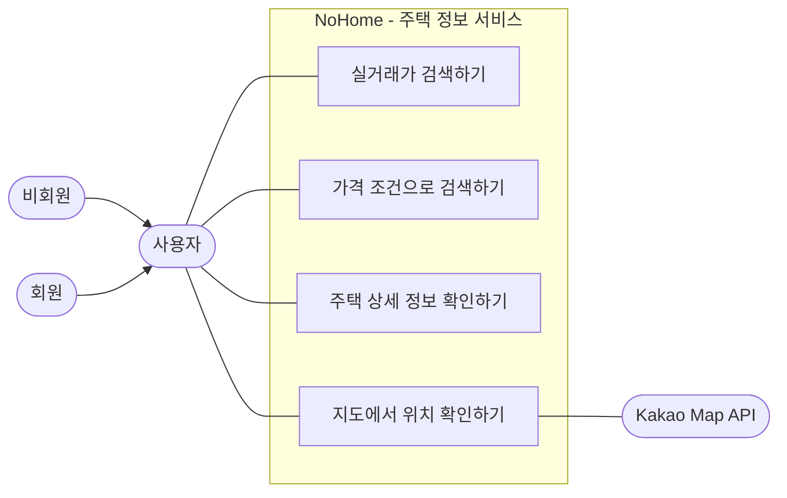
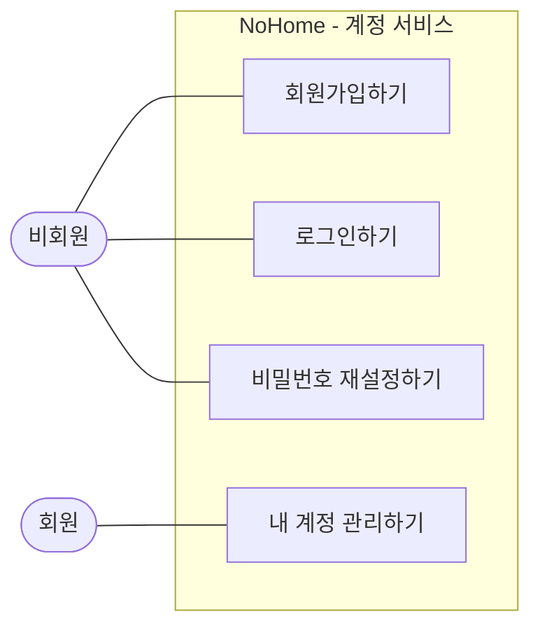
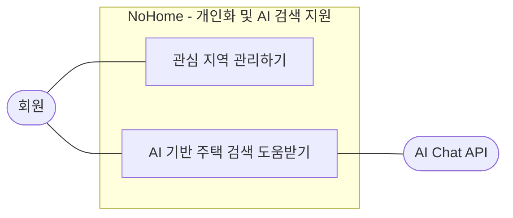
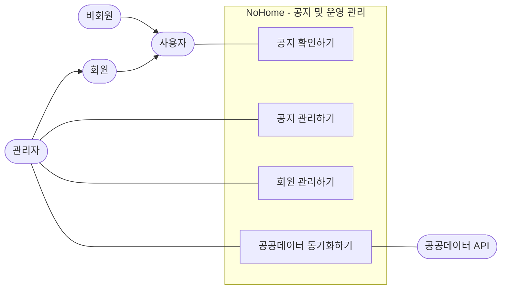
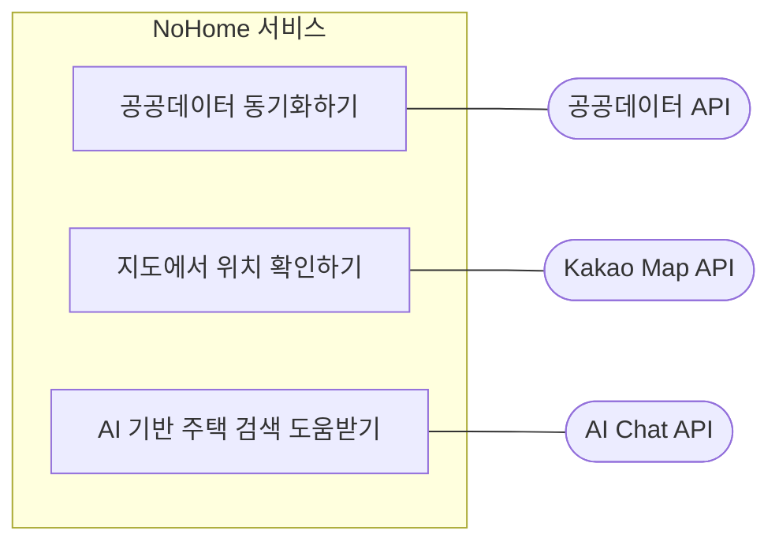

# NoHome Use Case Diagrams

현재 프로젝트 기준의 usecase 다이어그램을 Mermaid Markdown으로 정리한다.
한 그림에 모든 기능을 담으면 액터 연결선이 많아지므로, 전체 개요와 서비스별 확대도 중심으로 분리했다.

## 기준 소스

- Product docs: `no-home-artifact/docs/PRD.md`, `no-home-artifact/docs/spec.md`
- Backend endpoints: `no-home-backend/src/main/java/com/ssafy/home`
- Frontend user flows: `no-home-frontend/src/App.vue`

## 1. 전체 Use Case 개요

읽는 법:

- `사용자`는 비회원과 회원의 공통 상위 액터다.
- `회원`은 `사용자`가 할 수 있는 일을 포함하고, 개인화 기능을 추가로 사용한다.
- `관리자`는 회원 권한을 가진 운영 액터이며, 공지와 데이터 운영 기능을 사용한다.

생략 기준:

- `Controller`, `Service`, `Mapper`, `DB`, `JWT Filter`, `Scheduler` 같은 내부 구현 요소는 제외했다.
- 세부 CRUD는 제출 가독성을 위해 `관리하기` 단위로 묶었다.

## 2. 주택 정보 서비스 Use Case

읽는 법:

- 비회원과 회원 모두 주택 실거래가를 검색하고 상세 정보를 확인할 수 있다.
- `가격 조건으로 검색하기`는 가격 필터를 사용해 실거래가를 좁히는 사용자 목표다.
- Kakao Map API는 지도 위치 확인을 보조하는 외부 시스템이다.

생략 기준:

- 검색 파라미터 정규화, 페이징, 주소 변환 상태, 마커 렌더링 세부 로직은 제외했다.

## 3. 계정 서비스 Use Case

읽는 법:

- 가입 전 사용자는 회원가입, 로그인, 비밀번호 재설정을 수행한다.
- 로그인한 회원은 내 계정 정보를 관리한다.
- `내 계정 관리하기`는 내 정보 조회, 수정, 회원 탈퇴를 묶은 usecase다.

생략 기준:

- 토큰 발급, 쿠키 저장, 세션 확인, 인증 인터셉터는 내부 인증 처리이므로 제외했다.

## 4. 개인화 및 AI 검색 지원 Use Case

읽는 법:

- 관심 지역 기능과 AI 검색 지원은 로그인한 회원의 개인화 기능이다.
- `관심 지역 관리하기`는 관심 지역 등록, 목록 조회, 삭제를 묶은 usecase다.
- `AI 기반 주택 검색 도움받기`는 AI에게 질문하고 검색 조건 적용 도움을 받는 목표를 하나로 묶은 usecase다.

생략 기준:

- AI tool calling, rate limit, conversation memory, page action command 같은 내부 동작은 제외했다.

## 5. 공지 및 운영 관리 Use Case

읽는 법:

- 공지 확인은 비회원과 회원 모두 가능한 사용자 기능이다.
- 공지 관리, 회원 관리, 공공데이터 동기화는 관리자 권한이 필요한 운영 기능이다.
- 공공데이터 API는 동기화 기능을 보조하는 외부 시스템이다.

생략 기준:

- 공지 작성, 수정, 삭제는 `공지 관리하기`로 묶었다.
- 회원 검색 등 관리자 회원 기능은 `회원 관리하기`로 묶었다.
- 공공데이터 XML 파싱, 중복 처리, 저장 로직은 내부 구현이므로 제외했다.

## 6. 외부 시스템 연동 Use Case

읽는 법:

- 외부 API는 NoHome의 기능을 사용하는 사용자가 아니라, 특정 usecase를 보조하는 외부 시스템 액터다.
- 공공데이터 API는 실거래가 데이터 동기화를 보조한다.
- Kakao Map API는 지도 위치 확인을 보조한다.
- AI Chat API는 AI 기반 주택 검색 도움을 보조한다.

생략 기준:

- API key, HTTP 요청/응답, 장애 처리, 캐싱 정책은 usecase 다이어그램의 범위에서 제외했다.

## 작성 기준 요약

- usecase 이름은 사용자가 이해하는 목표 중심의 동사형으로 작성했다.
- 비회원과 회원의 공통 기능은 `사용자` 액터에 연결해 중복선을 줄였다.
- 회원 전용 기능과 관리자 전용 기능은 권한 차이가 보이도록 별도 액터에 연결했다.
- 외부 API는 관련 usecase 뒤쪽에 연결해 사용자 액터처럼 보이지 않게 했다.
- `include`, `extend`는 제출용 가독성을 위해 사용하지 않았다.
