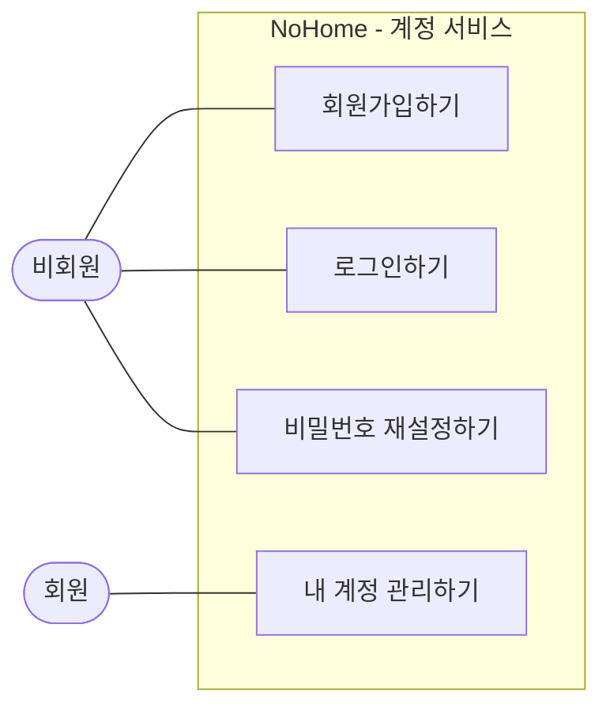

# 계정 서비스 Use Case

계정 서비스는 가입, 로그인, 비밀번호 재설정, 내 계정 관리처럼 사용자의 계정 목표를 표현한다.

```mermaid
flowchart LR
  Guest([비회원])
  Member([회원])

  subgraph NoHome["NoHome - 계정 서비스"]
    SignUp["회원가입하기"]
    LogIn["로그인하기"]
    ResetPassword["비밀번호 재설정하기"]
    ManageAccount["내 계정 관리하기"]
  end

  Guest --- SignUp
  Guest --- LogIn
  Guest --- ResetPassword

  Member --- ManageAccount
```

## 정리

- 로그인 전 목표는 `비회원`에 연결했다.
- 내 정보 조회, 수정, 탈퇴는 `내 계정 관리하기`로 묶었다.
- 토큰 발급, 쿠키 저장, 인증 필터 같은 내부 처리는 제외했다.
