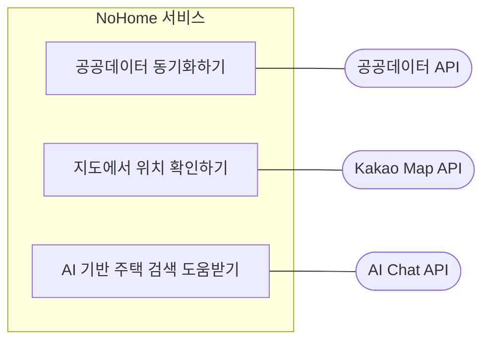

# 외부 시스템 연동 Use Case

외부 시스템 연동 다이어그램은 외부 API가 사용자가 아니라 NoHome 기능을 보조하는 시스템 액터임을 명확히 보여준다.

## 정리

- 공공데이터 API는 실거래가 데이터를 가져오거나 동기화할 때 사용하는 외부 시스템이다.
- Kakao Map API는 검색 결과 주소를 지도 위치로 보여줄 때 사용하는 외부 시스템이다.
- AI Chat API는 회원의 자연어 질문과 검색 도움 요청을 처리할 때 사용하는 외부 시스템이다.
- 외부 API를 `사용자`처럼 표현하지 않기 위해 관련 usecase 뒤쪽에만 연결했다.
