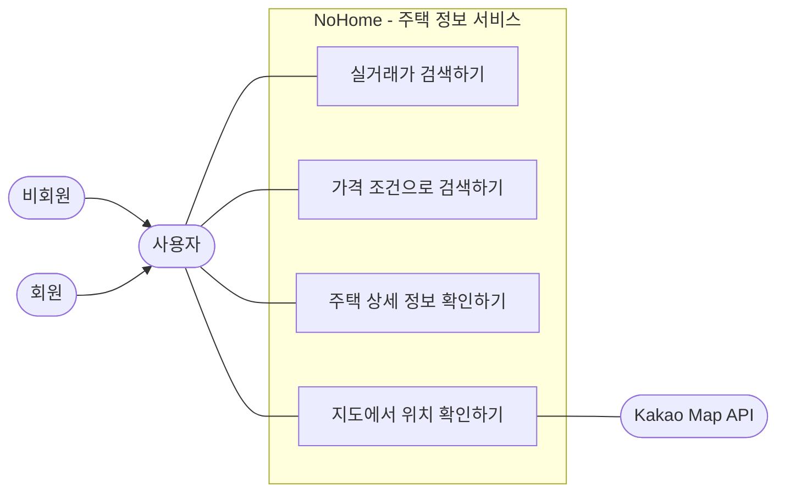

# 주택 정보 서비스 Use Case

주택 정보 서비스는 사용자가 지역, 거래월, 거래유형, 가격 조건으로 아파트 실거래가를 찾고 상세 정보와 지도 위치를 확인하는 흐름을 표현한다.

## 정리

- `비회원`과 `회원` 모두 사용할 수 있는 조회 기능은 `사용자`에 연결했다.
- `가격 범위 확인하기`는 의미를 명확히 하기 위해 `가격 조건으로 검색하기`로 표현했다.
- Kakao Map API는 지도 표시를 보조하는 외부 시스템으로만 연결했다.
