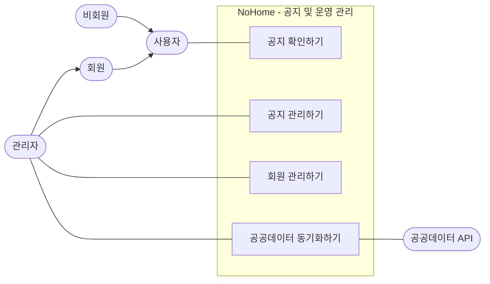

# 공지 및 운영 관리 Use Case

공지 및 운영 관리는 일반 사용자의 공지 확인과 관리자의 운영 목표를 함께 표현한다.

## 정리

- 공지 조회는 비회원과 회원 모두 가능하므로 `사용자`에 연결했다.
- 공지 작성, 수정, 삭제는 `공지 관리하기`로 묶었다.
- 회원 검색 등 관리자 권한이 필요한 회원 관련 기능은 `회원 관리하기`로 표현했다.
- 공공데이터 API는 `공공데이터 동기화하기`의 보조 외부 시스템으로 연결했다.
