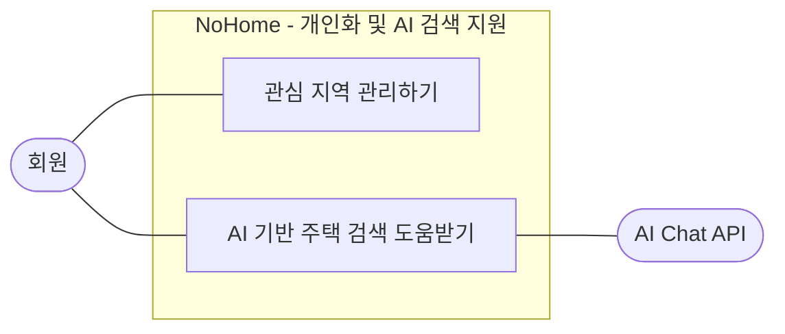

# 개인화 및 AI 검색 지원 Use Case

개인화 및 AI 검색 지원은 로그인한 회원이 관심 지역을 관리하고 AI를 통해 주택 검색 도움을 받는 흐름을 표현한다.

## 정리

- 관심 지역 등록, 목록 조회, 삭제는 `관심 지역 관리하기`로 묶었다.
- `AI에게 질문하기`와 `검색 조건 적용 요청하기`는 사용자 목표 기준으로 하나의 usecase로 통합했다.
- AI Chat API는 회원을 대신해 기능을 수행하는 액터가 아니라, AI 응답을 보조하는 외부 시스템으로 표현했다.
