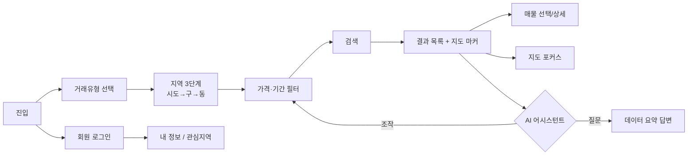

# NoHome 발표 구성안 (Outline)

> SSAFY 프로젝트 발표용 슬라이드 구성안. 목차 9개 섹션 기준으로 재배열.
> 형식: 요건 충족 + 기술 깊이 + 시연 균형 / 발표 시간 목표: 10~12분
> 자료 출처: `docs/deliverables`(요구사항명세·WBS·간트·AI보고서) + `docs/diagrams`(클래스·ERD·유스케이스) + `no-home-backend/docs`
>
> 범례 — 강조: `⭐` / **시각자료 상태**: ✅ 자산 있음(경로 표기) · 🟡 자동 생성됨(본 구성안 내) · ⬜ 앱 스크린샷 필요(별도) · 👥 팀 사진(플레이스홀더)

핵심 한 줄 메시지:
> **"공공데이터 실거래가를, API를 몰라도, 말 한마디로 검색한다."**

추가 기능(차별점) = **AI 어시스턴트** (Spring AI Tool Calling 기반 자연어 검색·화면조작)

---

## 목차 (9 섹션)

1. 기획 배경 · 목표 (추가 기능 중심)
2. 추진 계획 — 팀 전체 일정 & 개인별 일정
3. 시장 분석 — 경쟁 제품/서비스 비교, 차별화 전략
4. 개발 결과 — 핵심 기술 · 구현 내용
5. 개발 환경 & 전체 시스템 구조도
6. 화면 흐름도 및 시연
7. 적용 패턴 및 핵심 알고리즘
8. 기대 효과
9. 개발 후기 — 팀 사진, 개인별 회고

---

## 섹션 1. 기획 배경 · 목표 (추가 기능 중심)

### 1-0. 타이틀
- 프로젝트명 `NoHome` + 한 줄 정의 + 팀명(이정헌·최민식·전효준)/발표자/날짜
- **시각자료**: ⬜ 대표 화면(검색+지도) 스크린샷 1장

### 1-1. 문제 정의 — 왜?
- **메시지**: 실거래가는 공개돼 있지만 일반인은 쓰기 어렵다
- 국토부 공공데이터 API는 XML 응답 + 법정동코드(LAWD_CD) + 계약년월(DEAL_YMD) 진입장벽
- 매매/전세/월세가 서로 다른 API에 흩어짐 (RTMSDataSvcAptTrade / RTMSDataSvcAptRent)
- "우리 동네 30평대 아파트 요즘 얼마지?"에 바로 답하기 어렵다
- **시각자료**: ⬜ 원본 XML vs 우리 서비스 결과 카드 비교(스크린샷) — 대안 🟡 텍스트 대비 표

### 1-2. 필수 기능 & 목표
- **메시지**: 과제 필수 요건을 기준선으로 확정
- 필수: 실거래가 수집(F701)·검색(F702), 회원 CRUD+로그인(F712~716), 주택정보(F720), 지도 표시
- DB 선적재 + 검색은 DB 우선 조회 하이브리드 전략
- 회원 삭제는 물리 삭제, 인증은 로그인 기반

### 1-3. 추가 기능 = AI 어시스턴트 ⭐
- **메시지**: 필수를 넘어, "말로 검색하고 화면까지 조작"하는 AI 챗봇을 추가
- 도입 동기: 진입장벽(API·필터 조작)을 자연어로 완전히 제거
- 목표: ① 질문 모드(데이터 요약 답변) ② 에이전트 모드(필터·검색·화면 자동 조작)
- 기술 기반: Spring AI 1.1.2 + gpt-4o-mini (SSAFY GMS)
- 단계: 질문모드 → 에이전트 MVP → 액션/필터 확장 → **혼합형 재설계(단일 `/assistant`)·단기 대화기억** (2026-06-21~24)
- **시각자료**: ✅ [04-personal-ai-service](../diagrams/images/usecase/04-personal-ai-service.png)(AI 검색 유스케이스) + ⬜ 챗봇 대화→화면 변화 전후 스크린샷

---

## 섹션 2. 추진 계획 — 팀 전체 일정 & 개인별 일정

### 2-1. 전체 마일스톤 타임라인
- **메시지**: 문서 기반 Sprint로 단계적 추진 (일정은 git 커밋 실측 **2026-06-12~06-24**)
- 마일스톤 로드맵 (plan.md 근거):
  - M0 계획·하네스 / M1 골격·DB / M2 실거래가 데이터 / M3 회원·인증 / M4 화면·지도 연결 / M7 제출
  - Sprint 0 → 12까지 진행 (법정동 드롭다운 안정화까지), AI 챗봇은 별도 트랙
- **시각자료**: ✅ [wbs-gantt.md](../deliverables/wbs-gantt.md) Mermaid 간트 + [no-home-deliverables.xlsx](../deliverables/no-home-deliverables.xlsx)(간트 시트)

### 2-2. 개인별 역할 & 일정
- **메시지**: 역할 분담과 담당 영역 (git 실측·PR 근거)
- **담당 3인**: 이정헌(AI 어시스턴트, 06-12~24) · 최민식(공공데이터·검색·인프라, 06-14·06-22~24) · 전효준(회원·인증·지도·관심지역·공지, 06-18·06-23~24)
- **시각자료**: ✅ [wbs-gantt.md](../deliverables/wbs-gantt.md) 간트의 담당자별 스윔레인 + 담당·일정 요약표

---

## 섹션 3. 시장 분석 — 경쟁 제품/서비스 비교, 차별화 전략

### 3-1. 경쟁 서비스 비교
- **메시지**: 기존 부동산 서비스 대비 위치 — 핵심 차별은 **자연어 AI 화면조작**
- 🟡 비교 매트릭스 **초안** (⚠️ 타사 열은 일반 인식 기반 추정 — **발표 전 실제 서비스로 검증 필요**. NoHome 열만 구현 확정)

  | 항목 | NoHome | 호갱노노 | 직방 | 네이버 부동산 | KB부동산 |
  | --- | --- | --- | --- | --- | --- |
  | 실거래가 제공 | ✅ | ✅ | ✅ | ✅ | ✅ |
  | 지도 표시 | ✅ | ✅ | ✅ | ✅ | ✅ |
  | 공공데이터 직접 연동·적재 | ✅ | ? | ? | ? | ? |
  | **자연어 AI 검색·화면조작** | ✅ | ? | ? | ? | ? |
  | 가입 없이 진입장벽 낮음 | ✅(검색) | ? | ? | ? | ? |

  > `?` = 검증 필요(임의 단정 금지). 발표 시 실제 확인 후 ✅/❌로 확정.
- 차별 포인트: 대부분 서비스가 검색 UI는 제공하나 **자연어로 필터·페이지·지도를 조작하는 AI 에이전트는 희소**
- **시각자료**: 🟡 위 비교 매트릭스(검증 후 확정)

### 3-2. 차별화 전략
- **메시지**: NoHome의 3대 차별
  1. **자동 임포트** — 사용자가 API를 몰라도 검색 시 데이터가 채워짐
  2. **AI 에이전트** — 말로 검색·필터·페이지·지도 조작 (capability-driven)
  3. **공공데이터 정합성** — 출처 보존 + 중복제거 + 멱등 적재
- **시각자료**: 차별화 3축 다이어그램

---

## 섹션 4. 개발 결과 — 핵심 기술 · 구현 내용

### 4-1. 필수 기능 구현 현황 ⭐(평가 포인트)
- **메시지**: 과제 필수 기능을 빠짐없이 구현·검증
- 요구사항 매핑표 (F701/F702/F712~716/F720/지도) + 구현 근거 → [requirements-spec.md](../deliverables/requirements-spec.md) §3
- **시각자료**: ✅ [01-overview](../diagrams/images/usecase/01-overview.png)(전체 유스케이스: 비회원·회원·관리자) + 명세서 §3 매핑표

### 4-2. 핵심기능 ① 실거래가 검색 + 자동 임포트
- 5개 거래유형(매매/전세/월세/전월세/전체), 지역 3단계, 가격 이중 슬라이더, 정렬·페이징
- 전월세 스키마 마이그레이션(deposit/monthly_rent/contract_term 등, dealMode 매핑)
- 검색 = DB 우선, 부족분만 자동 적재 (구체 알고리즘은 섹션 7)
- **시각자료**: ✅ [02-house-service](../diagrams/images/usecase/02-house-service.png) + [house-search-class.svg](../diagrams/assets/house-search-class.svg) + [house-erd.svg](../diagrams/assets/house-erd.svg) / ⬜ 검색 패널 스크린샷

### 4-3. 핵심기능 ② 회원·인증·개인화
- 가입/조회/수정/물리삭제/로그인/로그아웃 — BCrypt, JWT(HS256) access·refresh, HttpOnly·Secure 쿠키, refresh 블랙리스트, 운영 fail-closed
- **관리자 권한 분리**: `/api/members/search`는 관리자(`notice.admin-emails`)만, 일반회원 403
- **개인화·운영(추가기능)**: 관심지역(`/api/interest-regions`, F-INT), 공지사항(`/api/notices`, F711) — 비회원 조회·관리자 CRUD
- **시각자료**: ✅ [03-account-service](../diagrams/images/usecase/03-account-service.png) + [05-notice-operation](../diagrams/images/usecase/05-notice-operation.png) + [member-auth-class.svg](../diagrams/assets/member-auth-class.svg) + [member-erd.svg](../diagrams/assets/member-erd.svg)

### 4-4. 추가기능 ③ AI 어시스턴트 — 구현 ⭐⭐
- **단일 엔드포인트 `POST /api/ai/assistant`** — LLM이 tool calling으로 질문/조작을 분기 (레거시 `/chat`·`/agent` 모드토글 제거, breaking change로 통합)
- 응답 계약 `AssistantResponse { type: answer|command, answer, command, notice }`
- 액션 6종(applyFiltersAndSearch/setFilters/paginate/selectItem/mapFocus/reset) + clarify 가드 + 필터 9종
- 진화: 질문모드(Phase1) → 에이전트 MVP(액션4·필터5) → Phase2 확장 → **혼합형 재설계(단일화)·단기기억 도입** (상세: [ai-usage-report.md](../deliverables/ai-usage-report.md))
- **시각자료**: ✅ [04-personal-ai-service](../diagrams/images/usecase/04-personal-ai-service.png) + [ai-chatbot-class.svg](../diagrams/assets/ai-chatbot-class.svg) + AI보고서 §4 액션/필터 목록

### 4-5. 검증 현황 (수치) ⭐
- **메시지**: 테스트로 품질을 증명
- 단위/통합 **백엔드 177건 + 프론트 51건 = 228건 그린** (Failures/Errors 0), E2E·브라우저 시나리오 검증
  - <!-- 출처: 2026-06-24 최신 master 실측. backend `./mvnw.cmd test` surefire 36클래스 177건 / frontend `npm test` 51건 -->
- Sprint별 빌드·테스트·라이브 검증 후 Reviewer Pass
- **시각자료**: 🟡 테스트 수 추이 표(아래) + 시나리오 체크리스트(AI보고서 §6)

  | 단계 | 백엔드 | 프론트 |
  | --- | --- | --- |
  | 질문 모드 | 78 | 15 |
  | 에이전트 MVP | 105 | 28 |
  | Phase 2 | 113 | 44 |
  | 재설계 | 144 | 44 |
  | **최신 master 실측** | **177** | **51** |

---

## 섹션 5. 개발 환경 & 전체 시스템 구조도

### 5-1. 전체 시스템 구조도 ⭐
- **메시지**: 표준 3-tier + Docker 단일 실행
- Vue3 SPA → (Vite proxy /api) → Spring Boot REST → MyBatis → MySQL
- 외부 연동 3종: 국토부 공공데이터 API, SSAFY GMS(LLM), Kakao Map
- Docker Compose로 backend/frontend/MySQL 통합 기동
- **시각자료**: ✅ [backend-packages.svg](../diagrams/assets/backend-packages.svg)(패키지 아키텍처) + [06-external-systems](../diagrams/images/usecase/06-external-systems.png)(외부 연동) + [requirements-spec.md](../deliverables/requirements-spec.md) §2.1 3-tier(ASCII+Mermaid)

### 5-2. 개발 환경 & 기술 스택
- Backend: Java 17, Spring Boot 3.5.9, MyBatis 3, MySQL 8
- AI: Spring AI 1.1.2 (ChatClient, Tool Calling), gpt-4o-mini
- Frontend: Vue 3.5(Options API/SPA), Vite 5, Kakao Maps SDK
- 인프라/협업: Docker Compose, Git(브랜치 전략), 문서 기반 Sprint
- 환경값: 공공데이터 키 2종, GMS 키, Kakao 키 (gitignored)
- **시각자료**: 🟡 계층별 스택 표(텍스트) + [common-infra-class.svg](../diagrams/assets/common-infra-class.svg)

---

## 섹션 6. 화면 흐름도 및 시연

### 6-1. 화면 흐름도
- **메시지**: 사용자 동선 한눈에
- **시각자료**: 🟡 화면 흐름 플로우차트(Mermaid, 아래)

### 6-2. 라이브 시연 (DEMO) ⭐
- 시연 4단계 (상세: [demo-script.md](demo-script.md))
  1. 지역+거래유형 검색 → 결과+지도
  2. 가격 필터 조정 → 재검색
  3. AI에게 "월세로 보여줘, 보증금 1억 이하" → 화면 자동 변화
  4. 회원 로그인 → 내 정보
- **백업**: ⬜ 녹화 영상 + 단계별 스크린샷
- **시각자료**: ⬜ 라이브 화면

---

## 섹션 7. 적용 패턴 및 핵심 알고리즘 ⭐⭐(기술 깊이)

### 7-1. AI: Tool Calling + returnDirect 패턴 (구현 완료)
- 단일 `/api/ai/assistant`에서 LLM이 tool calling으로 분기 (분리형 → 혼합형 재설계)
- LLM에 2종 도구 부여:
  - 데이터 조회 도구 `searchSeoulAptDeals` (returnDirect=false → LLM 텍스트 답변, finishReason=STOP)
  - 페이지 액션 도구 6종 (returnDirect=true → 구조화 명령 AgentCommand 직접 반환, finishReason=returnDirect로 결정적 식별)
- "아무 도구도 안 부름"을 1급 선택지로 둬 의도 오분류(불만·모호 → 억지 action) 구조적 완화
- Phase 0 PoC로 Spring AI 1.1.2 returnDirect 실거동 실측 → A안 확정 후 정식 구현
- **시각자료**: ✅ [ai-chatbot-class.svg](../diagrams/assets/ai-chatbot-class.svg) + [ai-usage-report.md](../deliverables/ai-usage-report.md) §2·§4(발화→도구분기)

### 7-2. AI: Capability-driven Agent
- 단일 출처(filterSchema) + 프론트 최종 강제
- 프론트가 capabilities + currentFilters 동봉 → LLM은 allow-list 힌트로만 사용 → 프론트가 인식 키만 적용, 미인식 키 drop + 사후 안내
- 효과: 메인 필터 추가(전월세) 시 filterSchema 한 곳만 수정해도 에이전트 자동 적응 (capability drift 차단)
- 폼↔filterSchema 동기화 테스트(`emptyFilters()` 키 ⊆ `filterSchema`)로 drift 재발 차단
- 안전장치: 휘발성 대화기억(개인정보 미저장), 분당 10회·500자 제한, **거래월은 LLM이 아닌 서버 결정적 가드**(dealYmdError/AgentCommandGuards)
- **시각자료**: ✅ [ai-usage-report.md](../deliverables/ai-usage-report.md) §2·§4.5(capability·서버 가드)

### 7-3. AI: 단기 대화기억 + 저장소 선택 근거 ⭐(기술 의사결정)
- 멀티턴 맥락: `MessageWindowChatMemory`(InMemory, window 10, SystemMessage 보존) + `MessageChatMemoryAdvisor`를 중앙 ChatClient에 부착
- 대화 키 `conversationId = memberId:<세션 UUID>` — 사용자 격리 + 세션 분리. 원문은 백엔드 JVM 힙에만, 브라우저엔 키(UUID)만
- **저장소 트레이드오프 비교**: InMemory(채택) vs localStorage vs RDB vs Redis
  - InMemory 채택 이유: 의존성 0·최속·원문 비영속(프라이버시), "닫으면 초기화" 요구 부합 / 한계: 단일 인스턴스·재기동 휘발
  - 전환 시점: 스케일아웃 시 Redis+TTL, 영구보존 요구 시 RDB (ChatMemoryRepository 빈 1곳 교체로 저비용 전환)
- 멀티턴 검증: "마포구 시세" → "방금 그 지역?" → 맥락 응답 / 세션 격리·종료 초기화 확인
- **시각자료**: ✅ [ai-usage-report.md](../deliverables/ai-usage-report.md) §5.1 저장소 4안 비교표

### 7-4. 데이터: DB 우선 + 라이브 검색 성능 개선 ⭐
- 기본: 검색 → DB coverage 판단 → 부족분만 공공데이터 호출 → XML 파싱 → `api_row_hash` 중복제거 → 적재 → 재조회 (완료 batch는 import 이력으로 skip, 멱등)
- **성능 개선(미캐시 첫 조회 17초 문제)**:
  - 응답 경로/저장 경로 분리 → **API 응답 우선 + DB 백그라운드 batch 저장**
  - row-by-row(거래당 지역·아파트 upsert+select) → **batch upsert + INSERT IGNORE**로 DB 왕복 대폭 감소
  - 공공 API `numOfRows` 100 → 1000 (1,532건: 16페이지 → 2페이지)
  - 라이브 결과 렌더 키: `resultKey → apiRowHash → dealId` 폴백
- 거래유형 매핑: 월세 0원=전세 / 초과=월세, resultCode 성공 `{"00","000"}`, 응답코드 03=빈 결과(정상)
- **시각자료**: ✅ [publicdata-import-class.svg](../diagrams/assets/publicdata-import-class.svg) + [publicdata-import-erd.svg](../diagrams/assets/publicdata-import-erd.svg) + [wbs-gantt.md](../deliverables/wbs-gantt.md) 2.6

### 7-5. 보안·인코딩 패턴
- 인증: JWT HS256 + BCrypt + fail-closed(운영 secret 검증), `/members/search` 관리자 권한 분리
- 지역 매핑: SeoulLawdCodeResolver(서울 25개 자치구) + 법정동 catalog 머지
- 인코딩: mojibake 복구(SET NAMES utf8mb4, DB 읽기 시 보정)
- GMS 키 부재 시 graceful: AI만 503, 나머지 정상 기동(EnvironmentPostProcessor)
- **시각자료**: ✅ [member-auth-class.svg](../diagrams/assets/member-auth-class.svg) + [ai-usage-report.md](../deliverables/ai-usage-report.md) §3.3·§5.3·§5.4(인코딩·graceful·로깅)

---

## 섹션 8. 기대 효과

### 8-1. 기대 효과
- **사용자**: 공공데이터 진입장벽 제거 → 누구나 실거래가 탐색 / 자연어로 손쉬운 조작
- **기술**: Spring AI Tool Calling 실전 적용 사례 / DB 우선 + 자동 적재로 응답성·정합성 확보
- **확장성**: capability-driven 구조로 신규 필터·기능 저비용 확장
- **운영**: 개인정보 미기록 로깅 정책 + fail-closed 보안으로 안전 배포
- **시각자료**: 🟡 사용자/기술/확장 임팩트 3블록(텍스트)

---

## 섹션 9. 개발 후기 — 팀 사진, 개인별 회고

### 9-1. 트러블슈팅 회고 ⭐(설득력)
- 실제 문제 4~5선 (문제→원인→해결):
  1. 공공데이터 페이지네이션 누락(142건 중 10건) → 전체 페이지 적재
  2. resultCode "000" 오분류 → 성공 화이트리스트 보정(실측 근거)
  3. **미캐시 첫 조회 17초 지연** → 응답/저장 경로 분리(응답 우선 + 백그라운드 batch), numOfRows 1000
  4. Kakao 지도 사라짐(Vue 리렌더가 비-Vue DOM 제거) → 지도 상태 reactive 밖으로
  5. AI 인코딩 환각(mojibake 입력) → seed 더블 인코딩 수정
- **시각자료**: 🟡 문제→원인→해결 3컬럼 표 + [ai-usage-report.md](../deliverables/ai-usage-report.md) §3.3

### 9-2. 팀 회고 & 사진
- 👥 <!-- TODO: 팀 사진 삽입 (이정헌·최민식·전효준) -->
- <!-- TODO: 개인별 회고 1~2줄씩 (Keep/Problem/Try 또는 자유 형식) -->
- 잘된 점: 문서 기반 개발, 자동 임포트 UX, AI 차별화
- 한계: 서울 한정, 서울 전체 검색 시 API 호출량, 좌표 정책
- **시각자료**: 👥 팀 사진(플레이스홀더) + 🟡 회고 카드

### 9-3. 마무리 & Q&A
- 한 줄 메시지 재노출 + 깃/데모 링크 + 감사
- 예상 Q&A: `script.md` 하단 참조

---

## 발표 분량 가이드 (10~12분 기준)

| 섹션 | 슬라이드 | 시간 |
| --- | --- | --- |
| 1 기획배경·목표 | 1-0~1-3 | 2분 |
| 2 추진계획 | 2-1~2-2 | 1분 |
| 3 시장분석 | 3-1~3-2 | 1분 |
| 4 개발결과 | 4-1~4-5 | 2.5분 |
| 5 환경·구조도 | 5-1~5-2 | 1분 |
| 6 화면흐름·시연 | 6-1~6-2 | 2분 |
| 7 패턴·알고리즘 | 7-1~7-5 | 2.5분 |
| 8 기대효과 | 8-1 | 0.5분 |
| 9 개발후기 | 9-1~9-3 | 1분 |

> 시간 압박 시 축소: 3(시장분석 1장)·5-2(스택)·7(알고리즘 2개) → 최소 압축
> 강조 확대: 7-1/7-2/7-3(AI 패턴·단기기억)·4-4(AI 구현)·6-2(시연)

## 시각자료 현황 (재정비 결과)

✅ **확보됨 — `docs/diagrams`·`docs/deliverables`에 존재, 슬라이드에 바로 삽입**
- 패키지 아키텍처: `diagrams/assets/backend-packages.svg` (5-1)
- 클래스: `ai-chatbot`·`house-search`·`member-auth`·`publicdata-import`·`common-infra`·`notice-interest`-class.svg (4·5·7장)
- ERD: `house-erd`·`member-erd`·`publicdata-import-erd`.svg (4·7장)
- 유스케이스 6종: `diagrams/images/usecase/01~06-*.png|svg` (1·4·5장)
- WBS·간트: `deliverables/wbs-gantt.md`(Mermaid)·`no-home-deliverables.xlsx` (2장)
- 요구사항 매핑표: `deliverables/requirements-spec.md` §3 (4-1)
- AI 상세(분기·저장소 4안·정책): `deliverables/ai-usage-report.md` (4-4·7장)

🟡 **본 구성안에 자동 생성됨**
- 화면 흐름도 Mermaid (6-1) / 경쟁사 비교 매트릭스 초안·검증 필요 (3-1) / 테스트 추이 표 (4-5) / 3-tier 구조도(명세서 §2.1)

⬜ **앱 실행해 캡처 필요(별도 단계)**
- 검색+지도 / 챗봇 대화 전후 / 회원 화면 스크린샷, 라이브 시연 녹화

👥 **팀이 제공**
- 팀 사진, 개인별 회고 문구, 경쟁사 비교 `?` 칸 검증값
