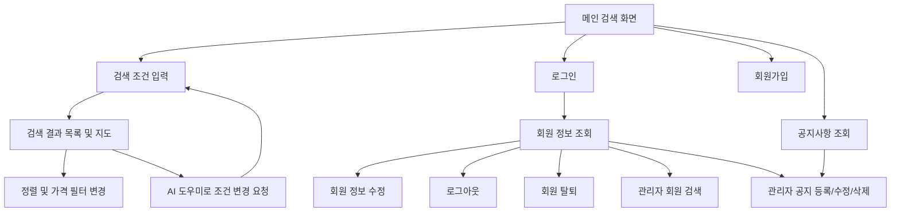
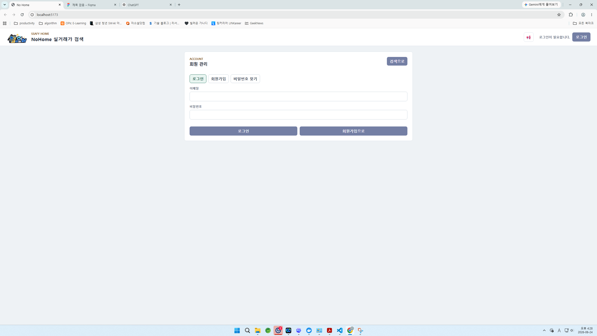
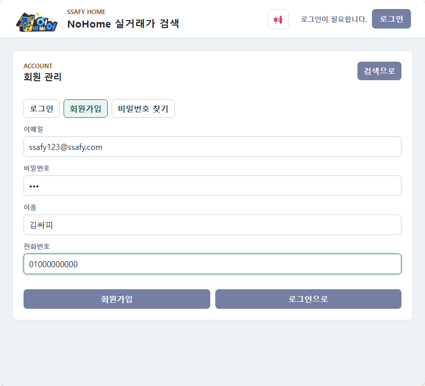
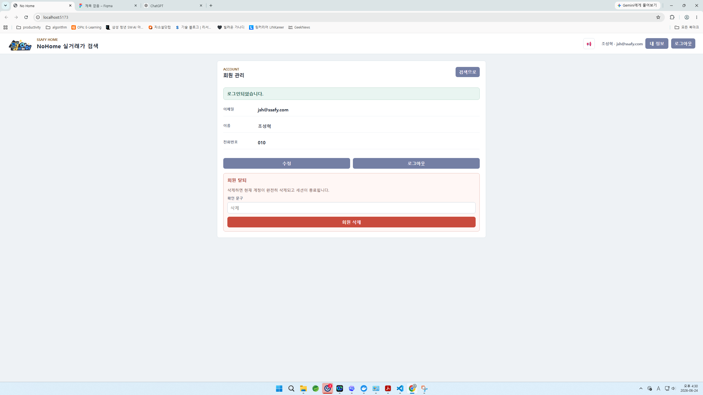
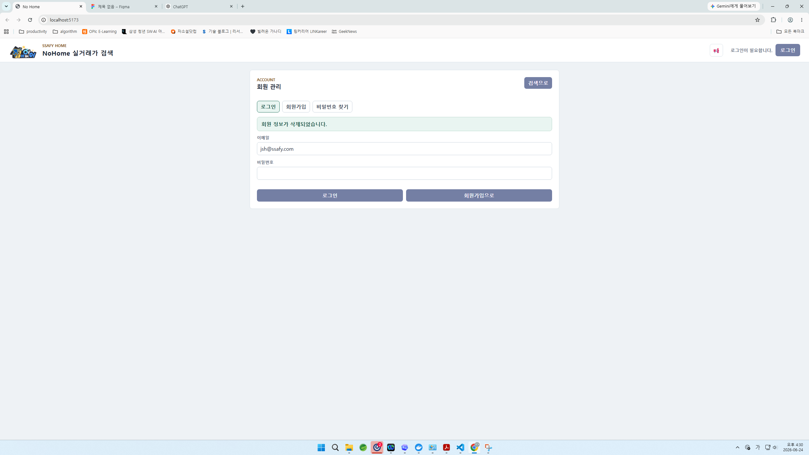
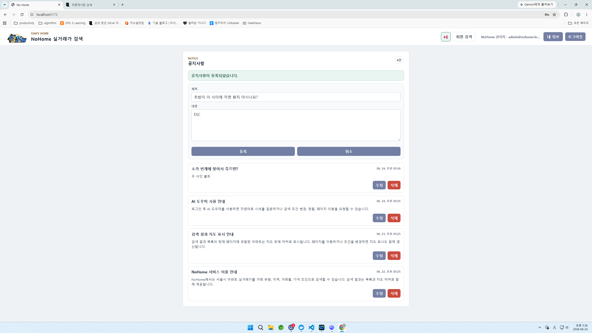
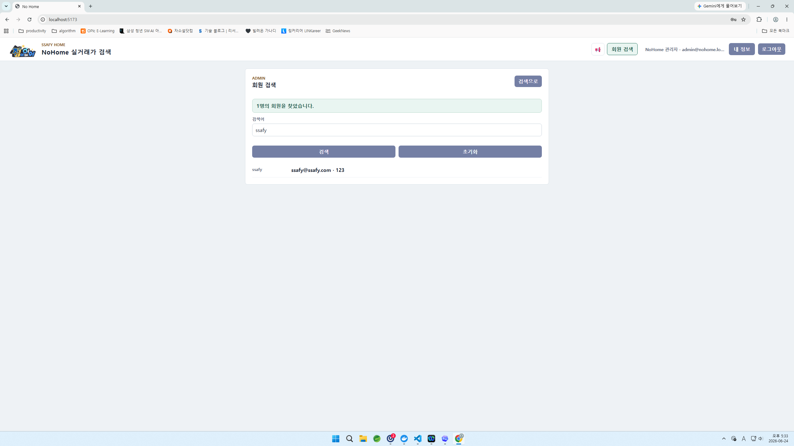
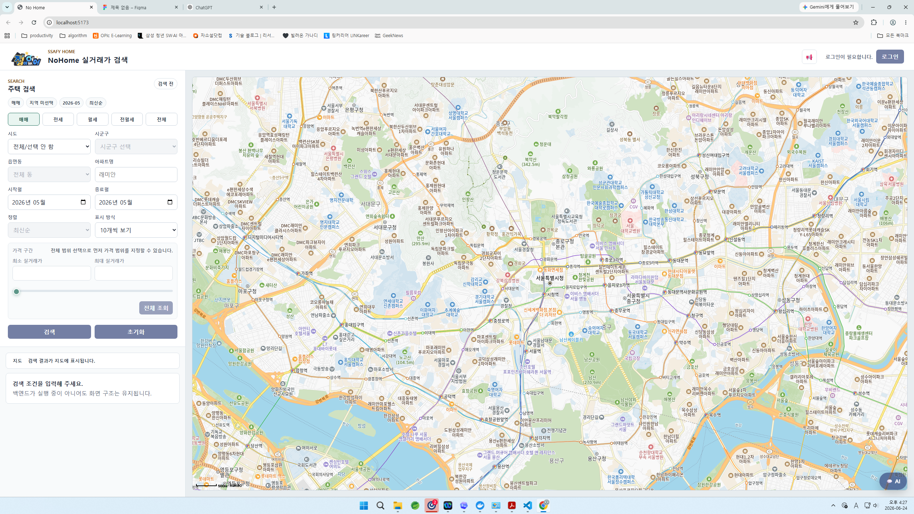
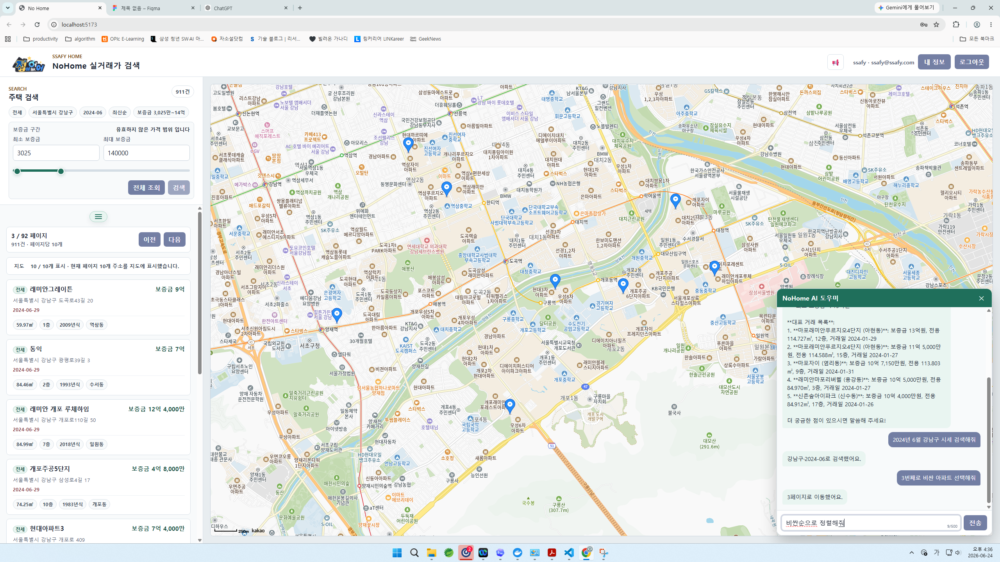
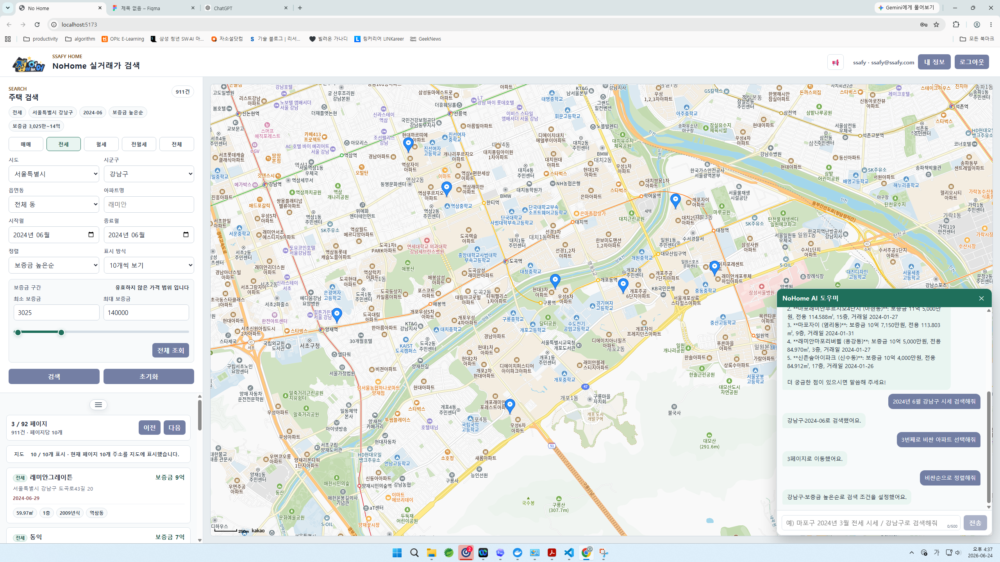

# NoHome 화면 설계서

## 1. 문서 개요

NoHome은 공공데이터 기반 아파트 실거래가를 검색하고, 지도에서 위치와 시세를 함께 확인할 수 있는 주택 검색 서비스이다. 본 화면 설계서는 회원 관리와 관리자 기능을 먼저 정리한 뒤, 공지사항 관리, 실거래가 검색, 지도 결과, AI 도우미가 포함된 주요 화면을 정의한다.

## 2. 화면 목록

| 화면 ID | 화면명 | 파일 | 주요 목적 |
| --- | --- | --- | --- |
| SCR-01 | 로그인 화면 | [login.png](screens/login.png) | 이메일/비밀번호 기반 로그인 |
| SCR-02 | 회원가입 화면 | [signup.png](screens/signup.png) | 신규 회원 정보 입력 및 가입 |
| SCR-03 | 회원 정보 화면 | [logined.png](screens/logined.png) | 로그인한 사용자의 계정 정보 조회, 수정/로그아웃/탈퇴 진입 |
| SCR-04 | 회원 삭제 후 로그인 화면 | [delete.png](screens/delete.png) | 회원 탈퇴 완료 메시지와 재로그인 상태 표시 |
| SCR-05 | 공지사항 관리 화면 | [noticeMake.png](screens/noticeMake.png) | 등록된 공지 목록 조회, 관리자 공지 등록/수정/삭제 |
| SCR-06 | 관리자 회원 검색 화면 | [memberSearch.png](screens/memberSearch.png) | 관리자가 기존 회원을 검색하고 기본 정보를 확인 |
| SCR-07 | 메인 검색 초기 화면 | [main_search.png](screens/main_search.png) | 검색 조건 입력, 지도 표시, 검색 전 상태 안내 |
| SCR-08 | 강남구 검색 결과 화면 | [gangnamgu search.png](screens/gangnamgu%20search.png) | 지역/거래유형/가격 조건 기반 결과 목록 및 지도 마커 표시 |
| SCR-09 | 보증금 높은순 검색 화면 | [highprice.png](screens/highprice.png) | 전세 보증금 필터와 정렬 결과 확인 |
| SCR-10 | 검색 결과 및 AI 도우미 화면 | [desc.png](screens/desc.png) | 검색 결과, 지도, AI 도우미가 함께 표시되는 복합 사용 상태 |

## 3. 사용자 흐름

## 4. 공통 레이아웃

| 영역 | 구성 요소 | 설명 |
| --- | --- | --- |
| 상단 헤더 | 로고, 서비스명, 공지 버튼, 로그인/회원 정보 버튼 | 모든 화면에서 공통으로 제공한다. 로그인 여부에 따라 "로그인이 필요합니다/로그인" 또는 사용자 이메일, "내 정보/로그아웃"을 표시한다. |
| 회원 관리 카드 | 입력 폼, 사용자 정보, 수정/로그아웃/회원 탈퇴 버튼 | 로그인, 회원가입, 회원 정보 조회, 회원 탈퇴 확인을 카드형 화면으로 제공한다. |
| 공지사항 카드 | 공지 제목, 총 건수, 등록 폼, 공지 목록, 수정/삭제 버튼 | 등록된 공지를 중앙 카드 형태로 표시한다. 관리자는 제목/내용 입력 폼으로 공지를 등록하고 기존 공지를 수정/삭제할 수 있다. |
| 관리자 회원 검색 카드 | 검색어 입력, 검색/초기화 버튼, 기존 회원 결과 목록 | 관리자 계정으로 로그인한 경우에만 접근할 수 있으며, 기존 회원을 이메일/이름/전화번호 기준으로 검색한다. |
| 좌측 검색 패널 | 거래 유형, 지역, 동, 아파트명, 거래월, 정렬, 가격 필터, 검색/초기화 버튼 | 실거래가 검색 조건을 입력하는 핵심 영역이다. 거래 유형에 따라 가격 필터와 정렬 옵션이 달라진다. |
| 중앙 지도 영역 | Kakao Map, 검색 결과 마커 | 검색 결과의 위치를 지도 위에 마커로 표시한다. 현재 페이지의 결과가 지도에 표시된다. |
| 결과 목록 | 페이지 정보, 이전/다음, 결과 카드 | 검색된 실거래가를 카드 형태로 표시한다. 카드에는 거래 유형, 아파트명, 주소, 거래일, 면적, 층, 건축연도, 동 정보, 가격을 표시한다. |
| AI 도우미 패널 | 대화 목록, 입력창, 전송 버튼 | 검색 결과 화면 위에서 자연어 기반 조건 변경, 시세 요약, 페이지 이동, 정렬 요청을 처리한다. |

## 5. 화면별 설계

### SCR-01. 로그인 화면

| 항목 | 내용 |
| --- | --- |
| 목적 | 기존 회원이 이메일과 비밀번호로 로그인한다. |
| 주요 UI | 이메일 입력, 비밀번호 입력, 로그인 버튼, 회원가입 이동 버튼, 비밀번호 찾기 탭 |
| 주요 동작 | 로그인 성공 시 상단 헤더에 사용자 이메일과 "내 정보/로그아웃" 버튼을 표시한다. |
| 예외 상태 | 인증 실패 시 로그인 화면에 실패 메시지를 표시하고 입력값을 유지한다. |

### SCR-02. 회원가입 화면

| 항목 | 내용 |
| --- | --- |
| 목적 | 신규 사용자가 계정을 생성한다. |
| 주요 UI | 이메일, 이름, 전화번호, 비밀번호, 비밀번호 확인, 회원가입 버튼 |
| 주요 동작 | 필수 정보를 입력하고 회원가입을 요청한다. 성공 시 로그인 화면 또는 로그인 완료 상태로 이동한다. |
| 검증 포인트 | 이메일 형식, 비밀번호 확인 일치, 필수값 입력 여부를 검증한다. |

### SCR-03. 회원 정보 화면

| 항목 | 내용 |
| --- | --- |
| 목적 | 로그인한 사용자의 계정 정보를 조회하고 계정 관련 동작을 수행한다. |
| 주요 UI | 이메일, 이름, 전화번호, 수정 버튼, 로그아웃 버튼, 회원 탈퇴 영역 |
| 주요 동작 | 수정 버튼 클릭 시 회원 정보 수정 화면으로 진입하고, 로그아웃 클릭 시 세션을 종료한다. |
| 위험 동작 | 회원 삭제는 확인 문구 입력 후에만 수행되도록 설계한다. |

### SCR-04. 회원 삭제 후 로그인 화면

| 항목 | 내용 |
| --- | --- |
| 목적 | 회원 탈퇴 완료 후 계정이 삭제되었음을 안내하고 로그인 화면으로 복귀한다. |
| 주요 UI | 삭제 완료 메시지, 이메일/비밀번호 입력, 로그인 버튼, 회원가입 이동 버튼 |
| 주요 동작 | 삭제 후 세션을 종료하고, 상단 헤더를 비로그인 상태로 전환한다. |
| 설계 의도 | 파괴적인 동작 이후 사용자가 현재 상태를 명확히 알 수 있도록 성공 메시지를 제공한다. |

### SCR-05. 공지사항 관리 화면

| 항목 | 내용 |
| --- | --- |
| 목적 | 등록된 서비스 공지사항을 조회하고, 관리자 계정은 공지사항을 등록/수정/삭제한다. |
| 주요 UI | 공지사항 제목, 총 건수, 관리자 등록 폼, 공지 목록, 수정/삭제 버튼, 저장 완료 메시지 |
| 일반 사용자 상태 | 등록된 공지사항 목록을 조회한다. 제목, 내용, 등록/수정 시각을 확인할 수 있다. |
| 관리자 상태 | 제목/내용 입력 폼과 등록 버튼이 표시된다. 기존 공지 카드에는 수정/삭제 버튼을 제공한다. |
| 주요 동작 | 상단 공지 아이콘을 클릭하면 공지사항 화면으로 이동한다. 관리자는 새 공지를 등록하고, 목록에서 기존 공지를 수정하거나 삭제할 수 있다. |
| 권한 처리 | 관리자 이메일 목록에 포함된 계정만 공지 작성/수정/삭제를 수행할 수 있다. |

### SCR-06. 관리자 회원 검색 화면

| 항목 | 내용 |
| --- | --- |
| 목적 | 관리자가 이미 가입된 기존 회원을 검색하고 기본 회원 정보를 확인한다. |
| 주요 UI | 회원 검색 버튼, 검색어 입력, 검색 버튼, 초기화 버튼, 검색 결과 목록 |
| 표시 정보 | 검색 결과 수, 회원 이름, 이메일, 전화번호 |
| 주요 동작 | 관리자 상단 메뉴의 "회원 검색" 버튼을 클릭하면 회원 검색 화면으로 이동한다. 검색어를 입력하고 검색하면 기존 회원 중 조건에 맞는 회원 목록을 표시한다. |
| 초기화 동작 | 초기화 버튼 클릭 시 검색어와 검색 결과를 비우고 기본 상태로 되돌린다. |
| 권한 처리 | 관리자 계정으로 로그인한 경우에만 회원 검색 메뉴와 화면을 표시한다. 비관리자는 접근할 수 없다. |

### SCR-07. 메인 검색 초기 화면

| 항목 | 내용 |
| --- | --- |
| 목적 | 사용자가 실거래가 검색 조건을 입력하기 전 기본 화면을 제공한다. |
| 주요 UI | 거래 유형 탭, 지역 선택, 아파트명 입력, 시작월/종료월, 정렬, 표시 방식, 가격 구간, 검색 버튼, 지도 |
| 기본 상태 | 지도는 기본 중심 좌표를 표시하고, 결과 목록에는 "검색 조건을 입력해 주세요" 안내를 노출한다. |
| 주요 동작 | 검색 버튼 클릭 시 입력 조건을 API 파라미터로 변환하여 `/api/houses/search`를 호출한다. |
| 예외 상태 | 지도 API 키가 없거나 SDK 로딩에 실패하면 지도 영역 또는 상태 메시지에 오류를 표시한다. |

### SCR-08. 강남구 검색 결과 화면

| 항목 | 내용 |
| --- | --- |
| 목적 | 특정 지역과 거래 조건에 맞는 실거래가 결과를 목록과 지도에서 동시에 확인한다. |
| 주요 UI | 검색 조건 요약 칩, 결과 건수, 지도 마커, 페이지네이션, 결과 카드 |
| 표시 정보 | 총 결과 수, 현재 페이지, 페이지당 표시 수, 지도 표시 건수, 아파트명, 주소, 거래일, 가격, 면적, 층, 건축연도 |
| 주요 동작 | 이전/다음 버튼으로 페이지를 이동하고, 페이지가 변경되면 현재 페이지 결과 기준으로 지도 마커를 갱신한다. |
| 설계 의도 | 검색 조건과 결과가 한 화면에 유지되어 사용자가 조건을 수정하며 즉시 비교할 수 있다. |

### SCR-09. 보증금 높은순 검색 화면

| 항목 | 내용 |
| --- | --- |
| 목적 | 전세 거래에서 보증금 범위와 정렬 조건을 적용한 결과를 확인한다. |
| 주요 UI | 전세 탭, 보증금 구간 슬라이더/입력값, 보증금 높은순 정렬, 검색 결과 카드 |
| 주요 동작 | 보증금 최소/최대값을 조정하면 유효한 가격 범위를 기준으로 검색한다. |
| 검증 포인트 | 거래 유형이 전세일 때 매매 가격 필터가 아닌 보증금 필터가 표시되어야 한다. |
| 예외 상태 | 유효하지 않은 가격 범위인 경우 안내 문구를 표시하고 검색 버튼 동작을 제한하거나 결과를 빈 상태로 처리한다. |

### SCR-10. 검색 결과 및 AI 도우미 화면

| 항목 | 내용 |
| --- | --- |
| 목적 | 검색 결과, 지도 마커, AI 도우미가 함께 사용되는 실제 탐색 상태를 보여준다. |
| 주요 UI | 결과 목록, 지도 마커, AI 도우미 패널, 대화 내 검색 결과 요약 |
| AI 요청 예시 | "2024년 6월 강남구 시세 검색해줘", "3번째로 비싼 아파트 선택해줘", "비싼순으로 정렬해줘" |
| 주요 동작 | 사용자는 결과 목록과 지도를 보면서 AI 도우미에게 정렬 변경, 페이지 이동, 조건 변경을 요청할 수 있다. |
| 제한 조건 | 입력 길이는 제한되며, 전송 중에는 중복 요청을 막는다. 오류 발생 시 사용자에게 재시도 안내를 표시한다. |
| 설계 의도 | 검색 UI를 직접 조작하는 방식과 자연어 기반 조작을 동시에 제공하여 탐색 편의성을 높인다. |

## 6. 입력 및 상태 설계

| 구분 | 상태 | 화면 처리 |
| --- | --- | --- |
| 로그인 필요 | 비회원 접근 | 헤더에 "로그인이 필요합니다"와 로그인 버튼을 표시한다. |
| 인증 성공 | 로그인 상태 | 사용자 이메일, 내 정보, 로그아웃 버튼을 표시한다. |
| 인증 실패 | 로그인 오류 | 로그인 화면에 실패 메시지를 표시하고 입력값을 유지한다. |
| 회원가입 실패 | 입력값 오류 | 필수값, 이메일 형식, 비밀번호 확인 오류를 안내한다. |
| 회원 탈퇴 완료 | 계정 삭제 성공 | 삭제 완료 메시지를 표시하고 비로그인 상태로 전환한다. |
| 관리자 기능 | 관리자 로그인 | 공지 등록/수정/삭제 폼과 기존 회원 검색 버튼을 표시한다. |
| 관리자 기능 | 비관리자 접근 | 공지 작성과 기존 회원 검색 기능을 숨기거나 권한 오류 메시지를 표시한다. |
| 공지 등록 | 저장 성공 | "공지사항이 등록되었습니다" 메시지를 표시하고 목록을 갱신한다. |
| 공지 수정/삭제 | 처리 성공 | 성공 메시지를 표시하고 공지 목록을 다시 조회한다. |
| 회원 검색 | 결과 있음 | 검색 결과 수와 회원 목록을 표시한다. |
| 회원 검색 | 결과 없음 | 검색 결과가 없다는 안내를 표시한다. |
| 검색 전 | 조건 미입력 | 결과 영역에 검색 안내 메시지를 표시한다. |
| 검색 중 | API 요청 진행 | 검색 버튼 비활성화 또는 로딩 메시지를 표시한다. |
| 검색 성공 | 결과 있음 | 결과 건수, 페이지 정보, 목록 카드, 지도 마커를 표시한다. |
| 검색 성공 | 결과 없음 | 결과 없음 안내와 조건 완화 안내를 표시한다. |
| 검색 실패 | API 오류 | 오류 메시지와 재검색 가능 상태를 표시한다. |
| 지도 로딩 실패 | SDK/API 키 오류 | 지도 대신 오류 메시지를 표시하고 검색 목록은 유지한다. |
| AI 요청 중 | 응답 대기 | 전송 버튼 비활성화 및 대화 영역에 진행 상태를 표시한다. |
| AI 오류 | 응답 실패 | 오류 안내 메시지를 대화 영역에 표시한다. |

## 7. API 연동 요약

| 화면 | Method | Endpoint | 사용 목적 |
| --- | --- | --- | --- |
| 로그인 화면 | POST | `/api/auth/login` | 로그인 |
| 회원 정보 화면 | POST | `/api/auth/logout` | 로그아웃 |
| 회원가입 화면 | POST | `/api/members` | 회원가입 |
| 회원 정보 화면 | GET | `/api/members/me` | 현재 로그인 사용자 정보 조회 |
| 회원 정보 화면 | PUT | `/api/members/me` | 회원 정보 수정 |
| 회원 정보 화면 | DELETE | `/api/members/me` | 회원 탈퇴 |
| 공지사항 관리 화면 | GET | `/api/notices` | 공지사항 목록 조회 |
| 공지사항 관리 화면 | POST | `/api/notices` | 관리자 공지사항 등록 |
| 공지사항 관리 화면 | PUT | `/api/notices/{noticeId}` | 관리자 공지사항 수정 |
| 공지사항 관리 화면 | DELETE | `/api/notices/{noticeId}` | 관리자 공지사항 삭제 |
| 관리자 회원 검색 화면 | GET | `/api/members/search` | 관리자 기존 회원 검색 |
| 검색 화면 | GET | `/api/regions` | 시/군/구 선택에 따른 읍면동 목록 조회 |
| 검색 화면 | GET | `/api/houses/price-range` | 거래 유형과 조건에 따른 가격 범위 조회 |
| 검색 결과 화면 | GET | `/api/houses/search` | 실거래가 검색 결과 조회 |
| 검색 결과 및 AI 도우미 화면 | POST | `/api/ai/assistant` | 자연어 질의 처리 및 검색 화면 조작 명령 생성 |

## 8. 화면 설계 핵심 포인트

- 회원 기능은 검색 화면과 분리된 카드형 화면으로 제공하여 계정 관리 흐름을 명확하게 한다.
- 관리자 계정은 일반 회원 기능에 더해 공지사항 관리와 기존 회원 검색 메뉴를 사용할 수 있다.
- 회원 탈퇴처럼 되돌리기 어려운 동작은 확인 문구 입력 후 수행하고, 완료 후 상태 메시지를 제공한다.
- 공지사항과 회원 탈퇴 완료처럼 데이터가 없거나 상태가 바뀐 화면도 명확한 안내 메시지를 제공한다.
- 공지사항 관리는 조회 화면 안에서 등록/수정/삭제까지 처리해 관리자가 별도 화면 이동 없이 내용을 관리할 수 있게 한다.
- 기존 회원 검색은 관리자 전용 화면으로 분리해 운영 기능과 일반 회원의 내 정보 관리를 구분한다.
- 메인 화면은 검색 패널, 지도, 결과 목록을 한 화면에 배치하여 조건 변경과 결과 비교가 빠르게 이루어지도록 한다.
- 거래 유형에 따라 가격 필터와 정렬 옵션을 다르게 표시하여 불필요한 입력을 줄인다.
- 검색 결과는 목록과 지도 마커를 함께 제공하여 사용자가 위치와 가격을 동시에 비교할 수 있도록 한다.
- AI 도우미는 독립 화면이 아니라 검색 결과 화면 안에서 조건 변경, 정렬, 페이지 이동을 돕는 보조 패널로 사용한다.
